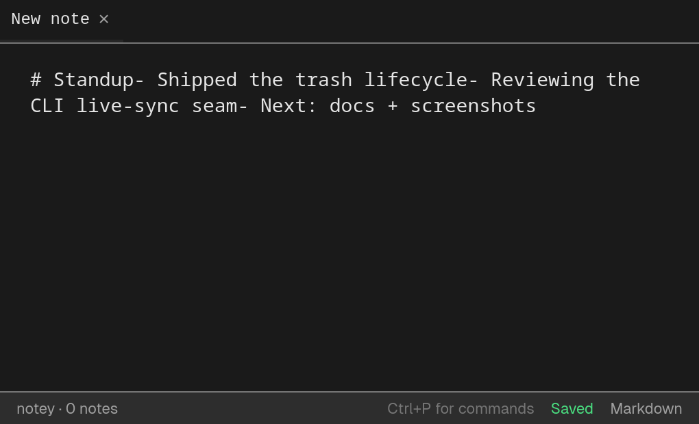
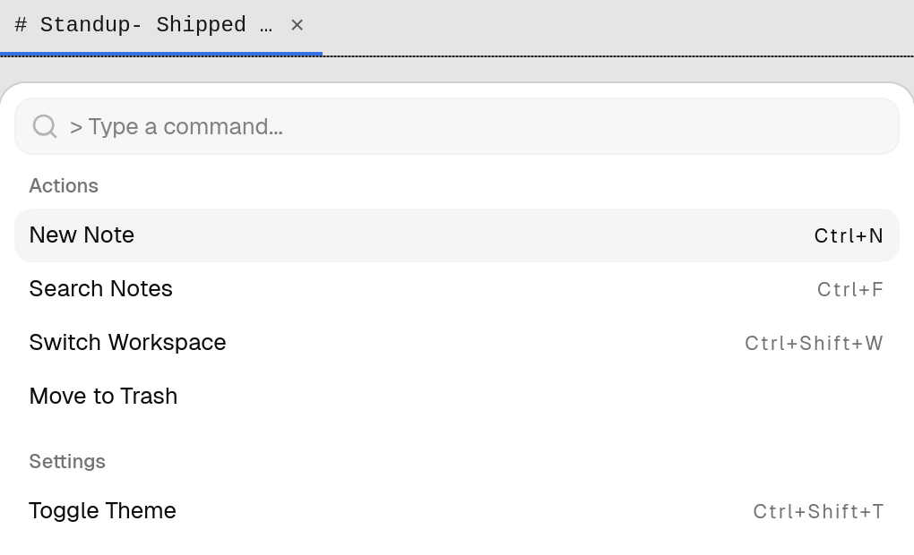
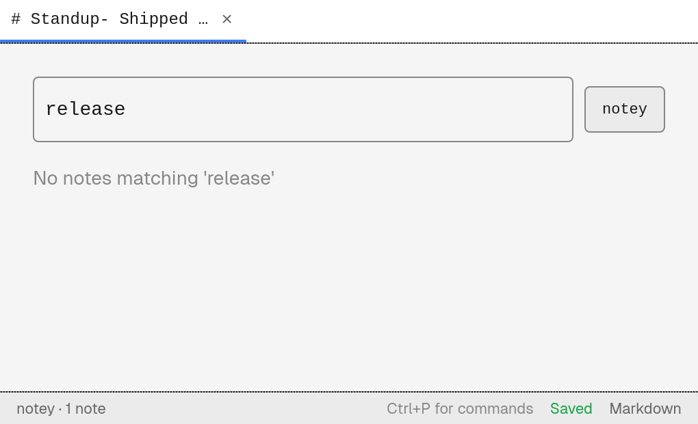
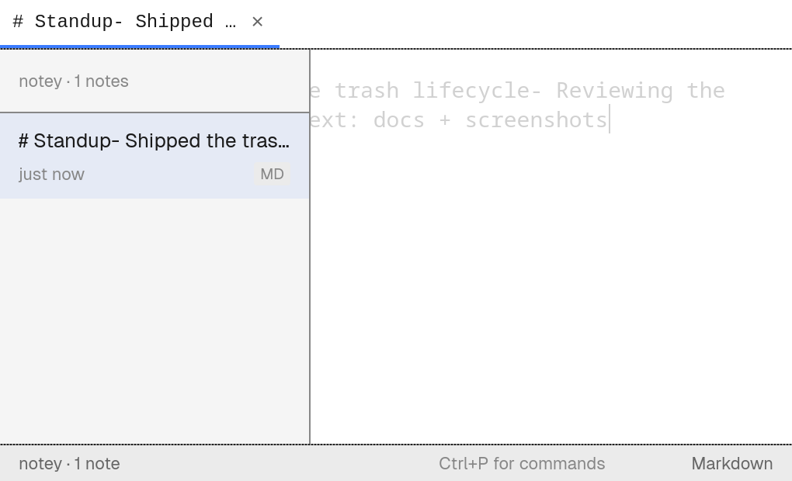
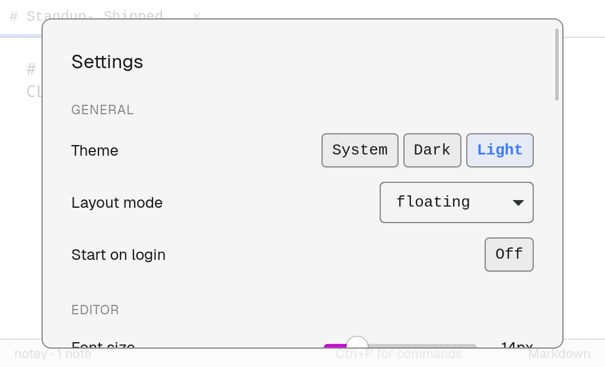
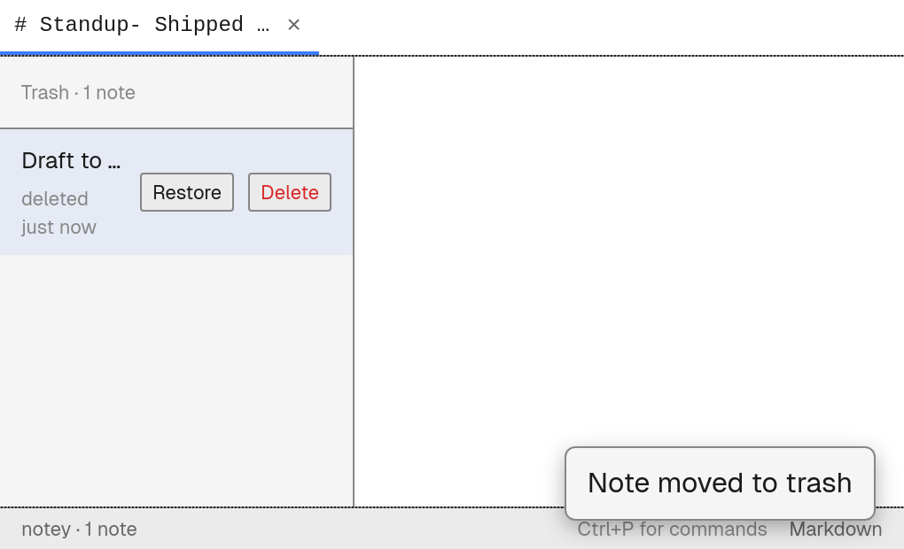
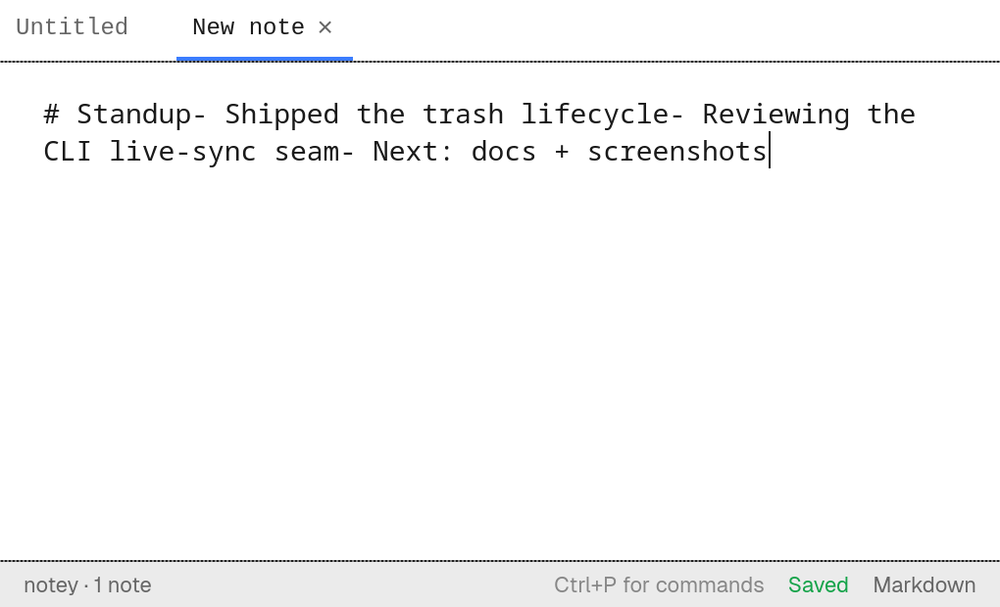

<div align="center">

# Notey

**A fast, keyboard-driven, workspace-aware note-capture app for your desktop.**

Summon it with a global hotkey, capture a thought, hit `Esc` — it's gone until you need it again.

[](https://github.com/pbean/notey/actions/workflows/ci.yml)
[](LICENSE)




</div>

## What is Notey?

Notey is a lightweight desktop notepad built for *quick capture*. It lives in your
system tray as a small always-on-top window that you summon with a global hotkey,
type into instantly, and dismiss with `Esc`. Notes are organized by **workspace**
(typically a project directory), searchable with full-text search, and persisted
locally in SQLite — no account, no cloud, no telemetry.

It's built with [Tauri 2](https://tauri.app), a React 19 + TypeScript front end, and a
Rust back end, so it starts fast, stays small, and runs natively on macOS, Linux, and
Windows.

## Features

- **Instant capture** — a global hotkey (default `Ctrl+Shift+N`) shows and focuses the
  window from anywhere; `Esc` hides it again.
- **Workspaces** — group notes by project directory; filter the list and search to the
  active workspace or view everything at once.
- **Full-text search** — SQLite FTS5 with BM25 ranking and match snippets.
- **Tabs** — keep several notes open at once, reorder them, and jump between them with
  the keyboard.
- **Markdown or plain text** — a CodeMirror 6 editor with per-note format toggle and
  auto-save (no save button, ever).
- **Command palette** — `Ctrl+P` for every action, fuzzy-searchable.
- **Trash & restore** — soft-delete with recovery and a configurable retention window.
- **Export** — dump your notes to Markdown files or a single JSON document.
- **CLI** — a `notey` command-line companion that talks to the running app over a local
  socket (add, list, search) with live desktop sync.
- **Themeable** — light / dark / follow-system, adjustable font, and floating /
  half-screen / full-screen layouts.
- **Accessible & keyboard-first** — full keyboard navigation, focus traps, and
  screen-reader announcements.

## Screenshots

| Command palette | Search | Note list |
| --- | --- | --- |
|  |  |  |

| Settings | Trash | Dark theme |
| --- | --- | --- |
|  |  |  |

## Install

Download the latest bundle for your platform from the
[Releases page](https://github.com/pbean/notey/releases), or
[build from source](docs/installation.md). See the
[installation guide](docs/installation.md) for platform-specific notes.

## Quick start

1. Launch Notey — it starts hidden in the system tray.
2. Press the global hotkey (`Ctrl+Shift+N`, or `Cmd+Shift+N` on macOS) to summon it.
3. Start typing. Your note auto-saves as you go.
4. Press `Ctrl+P` to open the command palette and discover everything else.
5. Press `Esc` to dismiss the window; summon it again any time.

New here? Read the [user guide](docs/user-guide.md) and the
[keyboard shortcuts](docs/keyboard-shortcuts.md).

## Development

Notey uses **npm** for the front end and **Cargo** for the Rust back end.

```sh
# Prerequisites: Node.js 20+, Rust (stable), and the Tauri system dependencies
# for your OS — see CONTRIBUTING.md.

npm install            # install front-end dependencies
npm run tauri dev      # run the app with hot-reload (Vite + Rust watch)
```

Other useful scripts:

```sh
npm run build          # type-check + build the front end
npm test               # front-end unit tests (Vitest)
node e2e/run.mjs       # end-to-end tests (tauri-driver)
npm run screenshots    # regenerate docs/images/*.png from the live app
```

For the full contributor workflow, system dependencies, and project layout, see
[CONTRIBUTING.md](CONTRIBUTING.md).

## Documentation

| Guide | What's inside |
| --- | --- |
| [Installation](docs/installation.md) | Install per platform & build from source |
| [User guide](docs/user-guide.md) | Feature-by-feature walkthrough |
| [Keyboard shortcuts](docs/keyboard-shortcuts.md) | Full shortcut reference |
| [Configuration](docs/configuration.md) | `config.toml` reference |
| [CLI](docs/cli.md) | The `notey` command-line companion |
| [Architecture](docs/architecture.md) | How Notey is built |
| [Roadmap](ROADMAP.md) | What's shipped and what's next |
| [Changelog](CHANGELOG.md) | Release history |

## Contributing

Contributions are welcome! Please read [CONTRIBUTING.md](CONTRIBUTING.md) and our
[Code of Conduct](CODE_OF_CONDUCT.md) before opening a pull request. Security issues
should follow [SECURITY.md](SECURITY.md).

## License

Notey is open source under the [MIT License](LICENSE).
