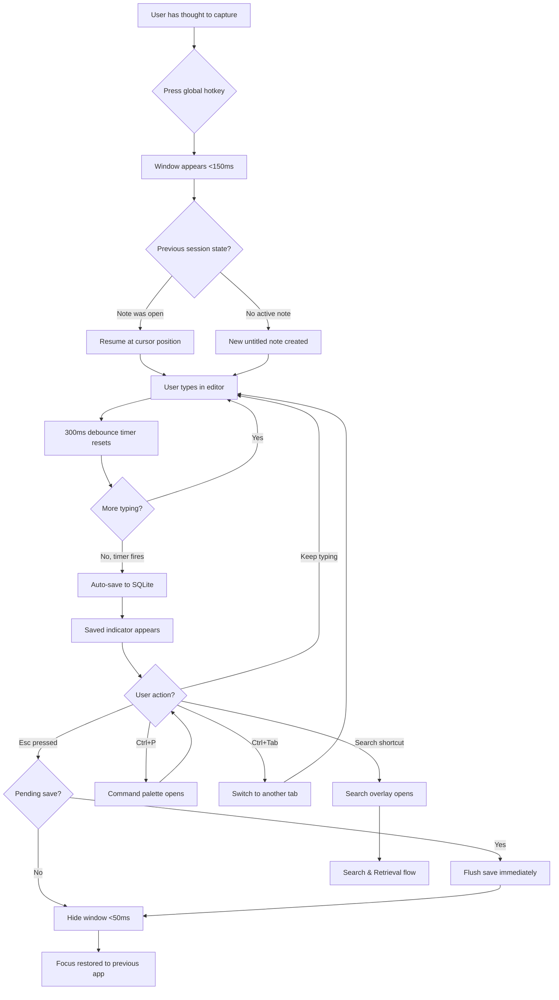
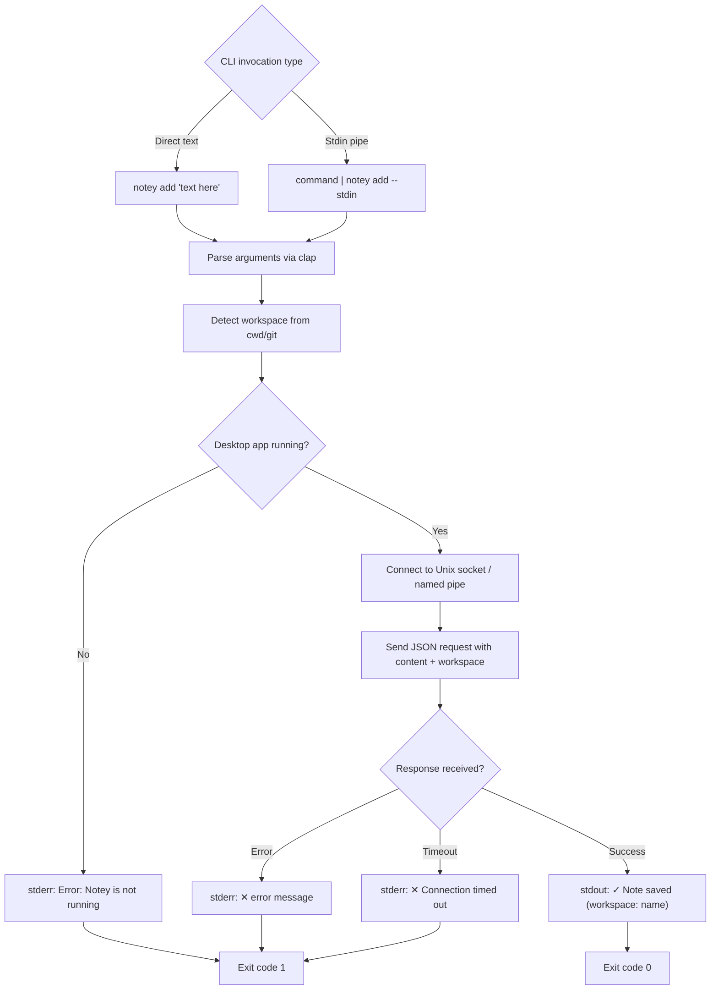
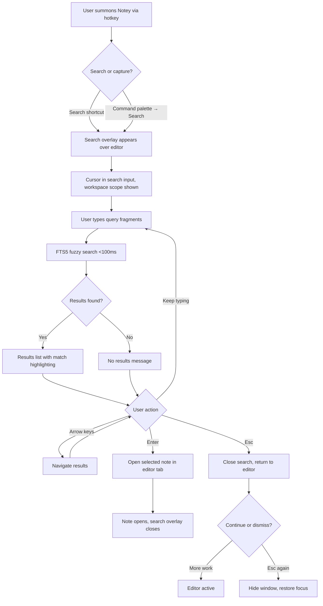
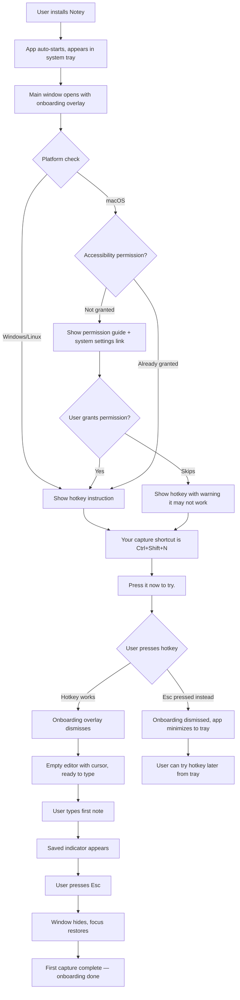

# UX Design Specification Notey

**Author:** Pinkyd
**Date:** 2026-04-02

---

<!-- UX design content will be appended sequentially through collaborative workflow steps -->

## Executive Summary

### Project Vision

Notey is a floating, keyboard-driven developer notepad that lives one global hotkey away from any workflow. Built on Tauri v2 (Rust + React), it delivers instant note capture and retrieval for developers who value flow state above all else. The core experience — press hotkey, type, auto-save, dismiss with Esc — targets a total interruption under 5 seconds. Notes are local-only (SQLite + FTS5), open source (MIT), and cross-platform (Windows, macOS, Linux as first-class citizens).

Notey's differentiation is the combination of five capabilities no competitor offers together: instant floating capture, CLI as a first-class citizen with stdin piping, workspace-aware note scoping via git repo detection, native Tauri performance (30-40MB idle), and clipboard capture with project context (post-MVP). The closest competitor, Heynote (5.2k GitHub stars), validates demand but lacks floating mode, global hotkey, CLI integration, and workspace awareness — and runs on Electron.

### Target Users

**Primary: The Flow State Guardian** — Developers who view every tool through the lens of "does this break my flow or preserve it?" They are keyboard-first, privacy-conscious, and hostile to bloatware. Three segments:

1. **Terminal Power Users** (persona: Kai) — Senior/Staff+ engineers, Linux-heavy, live in terminals. Want CLI-first capture (`notey add`, stdin piping, scriptable commands). Discover tools via dotfiles repos and Hacker News. The CLI is the viral vector for this segment.

2. **Full-Stack Multitaskers** (persona: Priya) — Mid-level developers juggling 14+ tools, losing 6-15 hours/week to context switching. Currently capture thoughts in "a WhatsApp group with just me." Want hotkey → type → Esc with zero configuration. The GUI capture loop is the conversion point for this segment.

3. **Linux Desktop Enthusiasts** — Underserved by existing tools (no Apple Notes on Linux, Electron alternatives rejected on principle). Evaluate tools by package availability, resource footprint, and Wayland compatibility. Notey's Tauri-on-Linux story is inherently compelling. Strategic wedge segment.

Additional personas: Marcus (new user — 60-second evaluation window, zero tolerance for setup friction) and Anika (OSS contributor — evaluates codebase quality, trait-based extension points, CI coverage).

### Key Design Challenges

1. **The 150ms Promise** — The entire UX hinges on the capture loop feeling instant. Window appearance, auto-focus, auto-save feedback, and Esc-dismiss must be choreographed so tightly that the user never perceives a "tool" — just thought → text → gone. Any animation, transition, or loading state that adds perceptible latency defeats the product.

2. **Two Interfaces, One Mental Model** — GUI and CLI users create and retrieve the same notes. Notes created via `notey add --stdin` from a terminal must feel like first-class citizens in the GUI, and vice versa. Workspace scoping, timestamps, and metadata must be coherent across both interfaces.

3. **Zero-Config Organization vs. Discoverability** — Workspace-aware scoping is automatic and invisible. Users need to understand their notes are scoped without being forced to configure anything. The challenge: making an invisible system visible enough to build trust, without adding friction.

4. **Information Density Without Clutter** — Multi-tab editing, workspace switching, search, command palette, save status, and format toggle create significant surface area for a "lightweight" tool. The UI must scale from "jot one line" to "23 notes across 4 workspaces" without feeling bloated in either state.

5. **Cross-Platform Visual Consistency** — Tauri uses native WebViews (WebKit on Linux, WebView2 on Windows) with differing font rendering, scrollbar behavior, and CSS edge cases. The UX must feel native-enough on each platform while maintaining a consistent Notey identity.

### Design Opportunities

1. **The Capture Loop as Brand** — The hotkey → float → type → Esc flow is the product's signature interaction. If this is delightful — smooth appearance, satisfying save confirmation, clean dismiss — it becomes the demo GIF, the word-of-mouth hook, and the muscle memory that drives retention. This single interaction is the primary conversion and retention mechanism.

2. **Progressive Disclosure of Power** — New users need "type and it saves." Power users need multi-tab, workspace switching, CLI integration. Progressive disclosure lets the UI start simple and reveal depth as users explore. The command palette (Ctrl/Cmd+P) is the perfect vehicle — every feature is discoverable without cluttering the default view.

3. **Developer-Native Aesthetics** — Monospace fonts, syntax highlighting, dark theme default, minimal chrome. This audience has strong opinions about how tools should look. Getting the visual language right (clean, code-aware, no rounded-corner-pastel-SaaS energy) builds instant credibility and signals "this was built by a developer, for developers."

## Core User Experience

### Defining Experience

The defining interaction of Notey is the **capture loop**: Hotkey → Window appears → Type → Auto-save → Esc → Back to work. This is the product's reason to exist, its competitive moat, and its primary retention mechanism. Every design decision flows from making this loop feel instant and invisible.

The secondary defining interaction is the **retrieval loop**: Hotkey → Search → Find note → Copy/use → Esc. Capture without retrieval is a write-only buffer. Search must be fast enough (sub-100ms) and forgiving enough (fuzzy matching) that users trust Notey as their single capture destination.

The tertiary interaction is the **CLI capture**: `notey add "text"` or `command | notey add --stdin`. This extends the capture loop into the terminal, making Notey composable with Unix tooling. Notes created via CLI are first-class citizens in the GUI — same data store, same workspace scoping, same search.

### Platform Strategy

- **Platform:** Cross-platform desktop application (Tauri v2) with standalone CLI companion binary
- **Interaction mode:** Keyboard-first, mouse-optional. Every feature reachable via keyboard. Mouse supported but never required.
- **Connectivity:** 100% offline. No network requests, no cloud, no accounts, no telemetry. Local SQLite storage with full data portability (Markdown/JSON export).
- **System integration:** System tray daemon (background, survives reboots), global hotkey registration, auto-start on login, clipboard monitoring (post-MVP)
- **Platform targets:** Windows 10/11 (MSI), macOS 12+ Intel/Apple Silicon (DMG), Linux X11 (DEB/AppImage), Wayland with XWayland fallback
- **Visual constraint:** Conservative CSS via Tailwind baseline to account for WebView rendering differences across platforms (WebKit on Linux, WebView2 on Windows). Accept font rendering differences; maintain consistent identity through layout, spacing, and color.

### Effortless Interactions

These interactions must require zero thought from the user — they should feel automatic, not designed:

1. **Saving** — Never manual, never fails, always confirmed. Auto-save triggers on a 300ms debounce after each keystroke. A subtle "Saved" indicator confirms persistence. Dismissing the window during a pending save flushes immediately — no data loss, ever.

2. **Organization** — Workspace scoping is automatic via git repository detection. Notes created in a project directory are scoped to that project without the user creating folders, assigning tags, or making any organizational decision. Non-git projects fall back to working directory. Manual workspace reassignment is available but never required.

3. **Focus Restoration** — Pressing Esc hides the window and restores focus to exactly where the user was (previous application, previous cursor position). The transition must feel like the window never existed — no flicker, no focus delay, sub-50ms.

4. **Finding** — Fuzzy search across all notes. No exact-match frustration. Results ranked by relevance. Search works across workspaces (unscoped view) or within a specific workspace. The search bar is immediately accessible when the window appears.

5. **Availability** — Auto-start on login, system tray residence, always one hotkey away. The user never "opens" Notey — it's always running, always ready. Cold start to system tray in under 1 second.

### Critical Success Moments

These are the make-or-break interactions that determine whether a user keeps or abandons Notey:

1. **First Capture (the 30-second conversion)** — User presses the hotkey for the first time, a floating window appears over their current work, they type something, they see "Saved" appear without pressing anything, they press Esc, their previous app is focused again. They press the hotkey again — their note is there. Total elapsed time: under 10 seconds. Reaction: "That was fast." If this doesn't feel instant, they uninstall.

2. **First Workspace Discovery (the aha moment)** — User captures notes while working in two different git repositories. They open Notey and realize notes are already separated by project — without having configured anything. Reaction: "Wait, it knows which project I'm in?" This is when Notey stops being "another notepad" and becomes "my notepad."

3. **First Retrieval Under Pressure** — User needs something they captured days ago. They open Notey, type a few characters in the search bar, fuzzy matching surfaces the note. Found in under 10 seconds. This is the moment Notey proves it's better than their WhatsApp hack or untitled text file — those capture, but they don't retrieve.

4. **First CLI Pipe (the Unix moment)** — Terminal user runs `docker logs | notey add --stdin` and sees the captured output appear in the GUI when they open it. Notey becomes a Unix citizen, composable with their existing workflow. This is the moment the CLI goes from "nice to have" to "I'm adding this to my aliases."

5. **First Onboarding (the 60-second test)** — New user installs, Notey starts, shows one instruction: "Your capture shortcut is Ctrl+Shift+N. Press it now." No account creation, no email, no tour carousel. If the user isn't capturing their first note within 60 seconds of installation, onboarding has failed.

### Experience Principles

These four principles guide every UX decision in Notey. When design choices conflict, resolve in this priority order:

1. **Invisible Until Summoned** — Notey has zero presence until the user needs it. No notifications, no badges, no "you haven't taken notes today." One hotkey summons it, Esc banishes it. The system tray icon is the only persistent evidence it exists. The app should feel less like software and more like a reflex.

2. **Speed Is the Feature** — Every interaction is measured in milliseconds, not seconds. If the user can perceive latency, it's a bug. No loading spinners, no skeleton screens in the capture loop. The window is pre-created and hidden — show/hide, not create/destroy. Animations exist only if they make the interaction feel faster, not to add polish.

3. **Context Follows the User** — Workspace scoping, auto-save, focus restoration — the app infers context from the environment so the user never has to declare it. Zero configuration is the default; configuration is optional power. The app adapts to the user's workflow, not the other way around.

4. **Type First, Organize Never** — Capture should never require an organizational decision. No "which folder?" No "add a tag?" No "name this note." Just type. Organization happens automatically (workspace scoping) or retroactively (search). The cost of capturing should be as close to zero as possible — every prompt, dialog, or required field is friction that kills adoption.

## Desired Emotional Response

### Primary Emotional Goals

**Relief** — "Finally, a tool that doesn't fight me." The dominant emotional response. Users arriving from scattered capture workarounds (WhatsApp self-messages, untitled tabs, random text files) should feel an immediate sense of friction dissolving. The emotional transition: from *anxiety about losing a thought* to *confidence that capture is handled*.

**Control Over Attention** — Not control over the app — control over their own focus. Notey gives developers back the 15-25 minutes they'd lose to a context switch. The feeling: "I captured that thought without leaving what I was doing." The user controls their attention, and Notey never competes for it.

**Invisible Satisfaction** — The highest compliment Notey can earn is not being noticed. The capture loop should become unconscious muscle memory — hotkey, type, Esc — like Ctrl+S or Ctrl+Z. When a tool disappears into habit, it has succeeded completely.

**Quiet Competence** — Notey makes users feel like better-organized developers without requiring organizational effort. Workspace scoping means their notes are already sorted by project. Search means anything is retrievable. The user didn't build a system — Notey inferred one. The feeling: "I look like I have my act together, and I didn't have to try."

### Emotional Journey Mapping

| Stage | Desired Emotion | Design Implication |
|---|---|---|
| **Discovery** (README, demo GIF) | Curiosity + recognition ("that's my problem") | Demo GIF shows the full capture loop in 5 seconds. Lead with the pain point, not the feature list. |
| **Installation** | Effortlessness | One command install. No account, no email, no wizard. Under 60 seconds to first capture. |
| **First capture** | Surprise at speed → immediate trust | Sub-150ms window appearance. Auto-save with visible confirmation. Esc restores focus perfectly. |
| **First workspace discovery** | Delight ("it already knows?") | Workspace name visible in UI without the user having configured it. Zero-effort aha moment. |
| **Daily use** | Invisibility — the tool disappears into habit | No notifications, no engagement loops. The hotkey becomes muscle memory. Notey is a reflex, not an app. |
| **Retrieval under pressure** | Confidence → relief | Fuzzy search forgives imprecise queries. Results appear instantly. "It's here, I can find it." |
| **Error state** | Calm, not alarm | Errors are quiet, non-blocking, and self-recovering. No modal dialogs for transient failures. Save failures show a subtle indicator; next keystroke retries naturally. |
| **Return after absence** | Familiarity — nothing changed | No "what's new" popups. No UI rearrangement. Notes are where they were. The tool waited patiently. |

### Micro-Emotions

**Confidence over Confusion** — Every interaction should confirm "yes, that worked." The save indicator, the focus restoration after Esc, the search results appearing instantly — each is a micro-confirmation that builds cumulative trust. Users should never wonder "did it save?" or "where did my note go?"

**Trust over Skepticism** — Developers are skeptical by nature. Trust is built through consistency (auto-save always works), transparency (data is local, exportable, in a single SQLite file), and restraint (no telemetry, no network requests, no dark patterns). Every interaction that works exactly as expected deposits into the trust account.

**Calm over Anxiety** — Data loss anxiety is the #1 emotion to eliminate. Auto-save with visual confirmation, SQLite WAL mode for crash safety, soft-delete with 30-day recovery — these aren't features, they're emotional insurance. The user should never feel nervous about their notes.

**Accomplishment over Frustration** — Finding a note captured days ago in under 10 seconds should feel like a small victory. Workspace scoping that "just works" should feel like earned organization. The product should make users feel effective without requiring effort.

### Design Implications

| Emotional Goal | UX Design Approach |
|---|---|
| **Relief** | Minimize steps in every flow. The capture loop is 4 actions (hotkey, type, auto-save, Esc). No confirmation dialogs, no save buttons, no "are you sure?" prompts during normal operation. |
| **Control over attention** | Floating window never steals focus from the underlying app on dismiss. Esc is always the exit. No modals that trap the user. No animations that delay the return to work. |
| **Invisible satisfaction** | No gamification, no streaks, no usage statistics. The app has no opinion about how often you use it. System tray icon is monochrome and unobtrusive. |
| **Quiet competence** | Workspace name shown subtly in the UI chrome — a quiet reminder that organization is happening. No celebration, no "You have 5 workspaces!" badges. |
| **Confidence** | Save indicator appears within 500ms of every edit. Transition from "Saving..." to "Saved" is visible but not distracting. Esc only hides the window after save completes — the user never loses data by dismissing too fast. |
| **Trust** | Zero network indicator on first launch (or absence of any network-related UI). Export always available. Data stored in a single, user-accessible SQLite file. No lock-in signals. |
| **Calm** | Error states are non-modal. Save failures show a subtle indicator, not an alert dialog. Auto-recovery on next keystroke. Soft-delete protects against accidental destruction. |

### Emotional Design Principles

1. **Earn Trust Through Restraint** — Every feature Notey *doesn't* have is a trust signal. No accounts, no cloud, no telemetry, no notifications, no engagement loops. Developers trust tools that respect their attention and their data. Restraint is the design language of trust.

2. **Confirm, Don't Celebrate** — Save confirmations should be matter-of-fact: a small "Saved" indicator that appears and fades. No confetti, no checkmarks with animations, no "Great job capturing that note!" The emotional register is calm competence, not enthusiastic cheerleading.

3. **Errors Are Whispers, Not Alarms** — When something goes wrong, the UI should communicate the issue without hijacking the user's attention. Subtle indicators, not modal dialogs. Self-recovery where possible. The user's flow state is more valuable than any error message.

4. **Disappearance Is the Goal** — The ultimate emotional success metric is that users stop thinking about Notey as a tool and start thinking of it as a capability they have. Like auto-complete or spell-check — it's just there, it just works, they'd notice if it were gone but they don't notice while it's working.

## UX Pattern Analysis & Inspiration

### Inspiring Products Analysis

**Spotlight / Raycast / Alfred — The Summon-Act-Dismiss Pattern**

These launcher tools define the interaction model Notey's capture loop must match. What they do well:
- **Instant appearance** — hotkey to visible in under 100ms. No launch animation, no splash screen. The window simply *is there*.
- **Auto-focus on input** — the cursor is in the text field the moment the window appears. Zero clicks to start typing.
- **Esc always exits** — universal, predictable, no state to manage. Esc means "I'm done, put everything back."
- **Muscle memory formation** — the hotkey becomes unconscious within days. Users stop thinking "I need to open Raycast" and start thinking "I need to do X" — the tool is invisible in the mental model.
- **Floating, non-disruptive** — appears over current work without rearranging windows or stealing focus from the underlying app on dismiss.

*Key lesson for Notey:* The capture loop must feel exactly this fast and predictable. The window is pre-created and hidden; hotkey shows it, Esc hides it. No creation/destruction, no layout recalculation, no loading state.

**Obsidian — The Power-Under-Simplicity Pattern**

Obsidian is the most successful developer-adjacent note tool. What it does well:
- **Local-first with zero cloud requirement** — files are plain Markdown on disk. Users trust it because they can see and touch their data. This philosophy directly validates Notey's local-only approach.
- **Command palette (Ctrl/Cmd+P)** — identical hotkey to VS Code. Provides access to every feature without cluttering the UI. The default view is clean; power is one keystroke away.
- **Plugin ecosystem** — community plugins extend functionality without bloating the core. Notey's trait-based plugin architecture should eventually enable this same pattern.
- **Keyboard-navigable everything** — power users rarely touch the mouse. Hotkeys for everything, configurable shortcuts, vim mode available.
- **Theming and customization** — dark/light themes, custom CSS, font configuration. Developers want to make tools feel like *their* tool.

*What to learn from but not replicate:*
- **Vault concept requires upfront organization** — users must create a vault, choose a directory, understand the file structure before capturing anything. This is the friction Notey must avoid. Notey's workspace scoping should be automatic, not user-configured.
- **Startup latency** — Obsidian takes 1-3 seconds to open depending on vault size and plugins. Acceptable for a knowledge base; unacceptable for instant capture. Notey must be sub-150ms.
- **Feature density** — Obsidian's UI can feel overwhelming with sidebars, panels, tabs, and plugin widgets. Notey's default state must be radically simpler — a text area and nothing else until you need more.
- **Electron resource footprint** — 200-300MB idle. Directly validates Notey's Tauri choice.

*Key lesson for Notey:* Obsidian proves that developers will deeply adopt local-first, keyboard-driven, extensible note tools. But Obsidian is a knowledge *management* tool. Notey is a knowledge *capture* tool. The UX must reflect that distinction — capture is fast and thoughtless, management is deliberate and structured. Notey should feel like the on-ramp to a system like Obsidian, not a competitor to it.

**VS Code Command Palette — The Progressive Disclosure Pattern**

The most successful progressive disclosure pattern in developer tooling. What it does well:
- **Single entry point for everything** — Ctrl/Cmd+P opens one input field that accesses files, commands, settings, extensions. No need to learn where features live in menus.
- **Fuzzy matching** — type fragments in any order, results update live. Forgiving of typos and imprecise memory.
- **Contextual results** — the palette knows what's relevant based on current state. Recently used items surface first.
- **Keyboard-completable** — arrow keys to select, Enter to execute. Full flow without mouse.
- **Consistent pattern** — once you learn the palette, you learn every feature. The UI complexity is compressed into a single interaction model.

*Key lesson for Notey:* The command palette should be the discovery mechanism for every feature beyond the basic capture loop. Workspace switching, export, settings, theme toggle, layout mode — all accessible from one Ctrl/Cmd+P input. New users don't need to know these exist until they're ready.

**fzf / ripgrep — The Fast Search Pattern**

These CLI tools define what "fast search" feels like for developers. What they do well:
- **Results appear as you type** — no "press Enter to search." Each keystroke narrows results instantly.
- **Fuzzy matching by default** — "ntsvr" matches "note_service.rs." Users don't need to remember exact terms.
- **Zero startup cost** — results begin streaming immediately. No loading indicator needed because results arrive before one would appear.
- **Minimal, information-dense output** — no chrome, no decoration. Just the results, highlighted where the query matched.

*Key lesson for Notey:* Search must feel this fast. FTS5 delivers sub-100ms queries, so the UX can be truly interactive — results updating with every keystroke. Highlight where the query matched in the result. No "Searching..." spinner. Results or "No results" — immediately.

### Transferable UX Patterns

**Navigation Patterns:**
- **Hotkey-summon overlay** (Spotlight/Raycast) → Notey's capture window. Floating, always-on-top, centered or positioned relative to tray icon. Appears instantly, dismisses with Esc.
- **Command palette** (Obsidian/VS Code) → Notey's feature discovery layer. Single input, fuzzy-matched commands, keyboard-completable. The universal access point for everything beyond basic capture.
- **Tab bar** (VS Code) → Notey's multi-note editing. Horizontal tabs with close buttons, reorderable, keyboard-switchable (Ctrl+Tab or Ctrl+1/2/3).

**Interaction Patterns:**
- **Type-to-filter** (fzf) → Notey's search. Results update on every keystroke, no submit button required. Query highlighted in results.
- **Auto-save with subtle confirmation** (Obsidian) → Notey's save indicator. Small, non-intrusive text that appears briefly after each save. No manual save action exists.
- **Esc-as-universal-back** (Spotlight/Raycast) → Notey's dismiss behavior. Esc always closes the current overlay/modal/window. Predictable, no exceptions.

**Visual Patterns:**
- **Monospace-first typography** (VS Code/terminal tools) → Notey's default font. Code-aware, developer-native. Proportional font available as option but not default.
- **Minimal chrome, maximum content** (Obsidian zen mode) → Notey's default view. The editor takes up nearly all the space. UI controls are subtle or hidden until needed.
- **Dark theme as default** (VS Code/terminal) → Notey ships dark. Light theme available. Matches the environment where developers spend most of their time.

### Anti-Patterns to Avoid

1. **Upfront organization requirement** (Obsidian vault setup, Notion workspace creation) — Any step between "I have a thought" and "I'm typing" is friction that kills the capture use case. No folder selection, no note naming, no format choice required before typing.

2. **Feature-wall onboarding** (Notion's template gallery, Obsidian's plugin recommendations on first launch) — Showing everything the app can do before the user has done the one thing they came for. Notey's onboarding is one instruction: "Press Ctrl+Shift+N."

3. **Save-as-action** (traditional file → save workflow) — Any UI that implies the user needs to manually save. No save button, no Ctrl+S behavior, no "unsaved changes" warning on close. Auto-save is the only save.

4. **Modal interruption for non-critical events** (desktop notification popups, "what's new" dialogs, update prompts on launch) — Any dialog or notification that appears without the user requesting it. Notey never initiates contact with the user.

5. **Engagement-loop patterns** (streak counters, usage statistics, "you captured 47 notes this week!" celebrations) — Any pattern designed to bring the user back to the app for its own sake. Notey exists to serve the user's workflow, not to maximize its own engagement metrics.

6. **Heavy animations and transitions** (macOS window minimize genie effect, page transition animations) — Any visual effect that adds perceived latency to the capture loop. If an animation takes longer than 50ms, it's too slow.

### Design Inspiration Strategy

**Adopt Directly:**
- Spotlight/Raycast summon-dismiss model → Notey capture window lifecycle
- VS Code/Obsidian command palette → Notey feature discovery (Ctrl/Cmd+P)
- fzf type-to-filter → Notey search interaction
- Obsidian local-first data philosophy → Notey trust model

**Adapt for Notey's Context:**
- Obsidian's keyboard navigation → simplify for fewer features, but maintain the same "mouse never needed" standard
- VS Code tab bar → lighter weight (fewer controls, no file icons, no dirty-state dots — auto-save means no unsaved state)
- Raycast's visual design language → adapt the clean, minimal, dark-first aesthetic but with monospace typography emphasis

**Deliberately Avoid:**
- Obsidian's vault/folder organization model → replace with automatic workspace scoping
- Obsidian's plugin-discovery-on-first-launch → defer all power features behind command palette
- Any Electron-era resource footprint expectations → Notey must feel native, not wrapped
- Any cloud/sync/account UI patterns → Notey is offline-only, and the absence of these is a feature

## Design System Foundation

### Design System Choice

**shadcn/ui + Tailwind CSS** — a themeable component system built on Radix UI primitives, copied into the project for full control. This is the design system foundation for all Notey UI components.

**Supporting technologies:**
- **Radix UI primitives** — headless, accessible component primitives that handle focus management, keyboard navigation, and ARIA attributes. The accessibility layer for Notey's "mouse optional" promise.
- **Tailwind CSS v4** — utility-first CSS framework providing conservative, cross-WebView-compatible styling. Dark mode support via class strategy.
- **CodeMirror 6** — standalone editor component (not part of the design system) for the note editing surface. Lightweight (~150KB), first-class Markdown support, keyboard-first, extensible.

### Rationale for Selection

1. **Keyboard accessibility as default** — Radix UI primitives provide complete keyboard navigation (focus trapping, arrow key cycling, Enter/Space activation, Esc dismissal) without custom implementation. For an app where "every interactive element is reachable via keyboard" (NFR21), this eliminates an entire class of accessibility bugs.

2. **Copy-into-project ownership** — shadcn/ui components are copied into `src/shared/components/ui/`, not installed as npm dependencies. This gives full control over every component's behavior and styling — critical for a product that needs precise visual control and can't afford unexpected upstream changes.

3. **Cross-WebView CSS safety** — Tailwind's utility classes compile to standard CSS properties. No CSS-in-JS runtime, no browser-specific hacks, no WebView fragmentation risks. Conservative by design — exactly what Tauri's multi-WebView environment requires.

4. **Developer-native aesthetic out of the box** — shadcn/ui's default visual language is clean, monochrome, low-chrome, and dark-theme-ready. Closer to VS Code than to consumer SaaS. Requires minimal customization to match Notey's "built by a developer, for developers" identity.

5. **Performance aligned with speed principle** — No CSS-in-JS runtime overhead. Tailwind purges unused styles at build time. Radix primitives are headless (no style weight). The total CSS footprint stays minimal, supporting the sub-150ms window appearance target.

### Implementation Approach

**Base components from shadcn/ui (copy into project):**
- Button, Dialog, DropdownMenu, Popover, Tooltip — standard UI primitives
- Command (cmdk) — powers the command palette (Ctrl/Cmd+P)
- Toast — save confirmation and error feedback
- Tabs — multi-tab editing chrome
- Input, ScrollArea — search bar and scrollable content areas

**Custom components (Notey-specific):**
- **CaptureWindow** — floating window container with show/hide lifecycle, focus management, and layout mode switching (floating/half-screen/full-screen)
- **EditorPane** — CodeMirror 6 wrapper with auto-save integration, format toggle (Markdown/plaintext), and Zustand store binding
- **SaveIndicator** — subtle "Saved" / "Saving..." text that appears and fades. Non-intrusive, non-blocking.
- **TabBar** — horizontal tabs with close buttons, reorder via drag (optional) or keyboard, active tab highlighting. Lighter than VS Code's tab bar — no file icons, no dirty-state indicators (auto-save eliminates unsaved state).
- **WorkspaceSelector** — dropdown or inline indicator showing current workspace name. Subtle presence — visible but not prominent. Switches workspace scope for note display and search.
- **SearchOverlay** — full-width search input with real-time results. Type-to-filter pattern (fzf-inspired). Results show note title, workspace, snippet with query match highlighted.
- **OnboardingOverlay** — first-run welcome with single instruction. Minimal, dismissible, never shown again.

### Customization Strategy

**Design Tokens (Tailwind + CSS variables):**

- **Typography:** Monospace-first. Default font: system monospace stack (`ui-monospace, SFMono-Regular, "SF Mono", Menlo, Consolas, "Liberation Mono", monospace`). Configurable via TOML settings (FR45). Proportional font available as user preference.
- **Color palette:** Dark theme default. Neutral grays for chrome, high-contrast text for readability. Accent color for interactive elements (links, active tab, search match highlights). WCAG 2.1 AA contrast ratios (4.5:1 text, 3:1 UI components) in both themes (NFR23).
- **Spacing:** 4px base unit grid. Tight spacing — Notey is information-dense, not spacious. Content area maximized, chrome minimized.
- **Border radius:** Minimal — 2-4px. Not rounded-corner-SaaS, not sharp-edge-brutalist. Subtle, functional.
- **Shadows:** Floating window gets a subtle drop shadow for depth separation from underlying desktop. Internal elements: no shadows. Flat, clean.
- **Transitions:** Maximum 50ms for any UI transition. Opacity fade for save indicator (appear: instant, fade-out: 2s). No slide, bounce, or scale animations.

**Theme System:**
- Dark theme: default. Dark background, light text, muted chrome.
- Light theme: available via settings or command palette. Inverted palette with same spacing and typography.
- Theme switching: instantaneous (CSS variable swap, no re-render). Respects system preference on first launch, then uses user's explicit choice.

## Defining Experience

### The Core Interaction

**"Press a hotkey, type your thought, press Esc — it's saved and you're back to work."**

This is Notey's defining experience — three actions that encapsulate the entire value proposition. Every design decision, every technical choice, every pixel on screen exists to make this sentence true in under 5 seconds.

The defining experience has three variants, each optimized for a different context:

1. **GUI Capture** — Hotkey → floating window → type → auto-save → Esc. The primary flow for most users. Optimized for speed and invisibility.
2. **CLI Capture** — `notey add "text"` or `command | notey add --stdin`. The terminal-native variant. Optimized for composability and scriptability.
3. **Retrieval** — Hotkey → search → find → copy/use → Esc. The complementary flow that makes capture valuable. Optimized for forgiveness (fuzzy matching) and speed (sub-100ms results).

All three variants share one principle: the user's primary task (coding, debugging, meeting) is never interrupted for longer than necessary. Notey is a subordinate tool — it serves the user's real work, never competes with it.

### User Mental Model

**Mental models users bring to Notey:**

1. **The launcher model** (from Spotlight/Raycast/Alfred) — "Press hotkey, something appears, I interact, I dismiss." Users who use launchers already understand the summon-act-dismiss pattern. Notey's capture loop maps directly: the "act" is typing instead of searching. These users will feel immediately at home.

2. **The scratch file model** (from untitled editor tabs, random text files) — "Open a buffer, type, forget about it." The current workaround for most developers. Notey upgrades this by making "somewhere" organized (workspace scoping) and "might find later" reliable (fuzzy search). These users need to discover that their notes are already organized — without being told.

3. **The knowledge base model** (from Obsidian/Notion) — "Choose a location, create a document, organize it." This is the mental model Notey must actively *not* reinforce. Users arriving from Obsidian may look for folders, tags, or templates. Notey's answer is: just type. Organization is automatic or retroactive.

**Potential confusion points and mitigations:**

| Confusion Point | User Expectation | Notey's Answer | Mitigation |
|---|---|---|---|
| "Where are my notes stored?" | Files on disk | SQLite database | Export to Markdown available; data location documented in settings |
| "How do I organize?" | Folders or tags | Workspace auto-scoping | Workspace name visible in UI chrome; no organizational UI prompts |
| "Which workspace am I in?" | Explicit selection | Auto-detected from context | Workspace indicator always visible; switchable via command palette |
| "Did it save?" | Manual save action | Auto-save on every edit | "Saved" indicator appears within 500ms of each edit |
| "Where's the save button?" | Ctrl+S habit | No save button exists | Ctrl+S is a no-op (or shows "Auto-saved" toast). No unsaved state exists |
| "How do I find old notes?" | Browse folders | Search-first retrieval | Search bar prominent in UI; fuzzy matching forgives imprecise queries |

### Success Criteria

**The capture loop succeeds when:**

1. **Time from intent to typing < 500ms** — User thinks "I need to write this down," presses the hotkey, and is typing within half a second. Window appearance (sub-150ms) + auto-focus on input = zero perceptible delay.

2. **Time from typing to saved < 800ms** — Last keystroke to "Saved" indicator. The 300ms debounce + write + confirmation must complete within this budget. The user should see confirmation before they think to look for it.

3. **Time from Esc to previous context = 0 (perceived)** — Sub-50ms focus restoration. The user's previous application, cursor position, and scroll position are exactly where they left them. No flicker, no refocus animation.

4. **Zero decisions required** — The user never chooses a folder, names a note, selects a format, or picks a workspace during the capture flow. Every decision point removed is friction eliminated.

5. **First-time success** — A user who has never seen Notey before completes the full capture loop on their first try, guided only by the onboarding instruction: "Your capture shortcut is Ctrl+Shift+N. Press it now."

6. **CLI parity** — A note created via `notey add "text"` is indistinguishable from a GUI-created note when viewed in the application. Same search, same workspace scoping, same metadata.

### Novel UX Patterns

**Established patterns adopted:**

| Pattern | Source | Application in Notey |
|---|---|---|
| Hotkey-summon floating window | Spotlight, Raycast, Alfred | Capture window lifecycle — pre-created, shown/hidden, never created/destroyed |
| Auto-save with visual confirmation | Google Docs, Obsidian | Debounced 300ms writes with "Saved" indicator — no manual save exists |
| Command palette for feature access | VS Code, Obsidian | Ctrl/Cmd+P as universal access point for all features beyond basic capture |
| Fuzzy type-to-filter search | fzf, ripgrep | Real-time search results updating on every keystroke, forgiving of typos |
| Tab bar for multi-document editing | VS Code, browsers | Horizontal tabs, keyboard-switchable, no unsaved-state indicators (auto-save) |

**Novel combinations unique to Notey:**

1. **Automatic workspace scoping** — No existing capture tool auto-detects the active git repository and scopes notes to it without configuration. This is zero-effort organization that no competitor offers. The UX challenge: making the invisible system visible enough to build trust without adding friction.

2. **CLI + GUI into one data store** — No existing tool treats terminal input (`stdin | notey add`) and GUI typing as equivalent entry points into the same organized system. The UX challenge: ensuring notes from both sources feel like first-class citizens in all views.

3. **Capture-dismiss as window lifecycle** — Unlike launchers (which execute a command and close) or note apps (which stay open), Notey's window is designed to be shown and hidden dozens of times per day. The lifecycle is optimized for frequency: pre-created, never destroyed, state preserved between shows.

### Experience Mechanics

**Flow 1: GUI Capture (Primary)**

```
1. INITIATION
   User presses global hotkey (default: Ctrl+Shift+N / Cmd+Shift+N)
   
2. WINDOW APPEARANCE (<150ms)
   - Pre-created hidden window becomes visible
   - Window appears as floating overlay, always-on-top
   - Position: centered on active monitor (floating mode) or screen edge (half/full)
   - Drop shadow separates window from desktop
   - No animation — instant appearance
   
3. AUTO-FOCUS
   - Cursor is in the editor text area immediately
   - If a note was being edited before dismiss, cursor returns to exact position
   - If no active note, a new untitled note is created automatically
   - Workspace auto-detected from last active CLI context or last used workspace
   
4. TYPING + AUTO-SAVE
   - User types freely in CodeMirror 6 editor
   - Markdown syntax highlighting active by default
   - Each keystroke resets the 300ms auto-save debounce timer
   - When timer fires: content saved to SQLite via WAL write
   - "Saved" indicator appears in status area (subtle, non-blocking)
   - "Saved" text fades after 2 seconds
   
5. DISMISS
   - User presses Esc
   - If save is pending (debounce timer active): flush immediately, wait for write confirmation
   - Window hides (not destroyed) — state preserved for next summon
   - Focus restores to previously active application (<50ms)
   - User is back to their primary task
```

**Flow 2: CLI Capture**

```
1. INITIATION
   User runs: notey add "circuit breaker threshold is wrong"
   — or —
   User runs: kubectl logs auth-svc | notey add --stdin
   
2. CONNECTION
   - CLI binary connects to running desktop app via Unix socket / named pipe
   - If desktop app not running: clear error message, non-zero exit code
   
3. NOTE CREATION
   - CLI sends JSON request with content and workspace (auto-detected from cwd/git)
   - Desktop app's note service creates the note (same code path as GUI)
   - FTS5 index updated via triggers
   
4. CONFIRMATION
   - CLI receives JSON response with note ID
   - Prints confirmation to stdout: "Note saved (workspace: infra-platform)"
   - Exits with code 0
   
5. GUI COHERENCE
   - Note appears immediately in GUI if window is open
   - Note is searchable, workspace-scoped, and indistinguishable from GUI-created notes
```

**Flow 3: Search & Retrieval**

```
1. INITIATION
   User presses global hotkey to summon window
   User focuses search bar (keyboard shortcut or click)
   — or —
   User opens command palette (Ctrl/Cmd+P) and types search query
   
2. QUERY INPUT
   - User types query fragments
   - Each keystroke triggers FTS5 fuzzy search (<100ms response)
   - Results update in real-time below the search input
   
3. RESULTS DISPLAY
   - Results ranked by relevance (FTS5 rank function)
   - Each result shows: note title (or first line), workspace name, date, snippet with query match highlighted
   - Workspace filter available (scope search to current workspace or search all)
   - Arrow keys navigate results, Enter opens selected note
   
4. NOTE ACCESS
   - Selected note opens in editor (new tab if multi-tab enabled)
   - User can copy content, edit, or dismiss
   
5. DISMISS
   - Esc closes search overlay (returns to editor)
   - Esc again hides window (returns to previous app)
   - Layered Esc: each press backs out one level
```

**Flow 4: First-Run Onboarding**

```
1. TRIGGER
   - App detects first-run state (no config file exists)
   - Onboarding overlay appears over the main window
   
2. SINGLE INSTRUCTION
   - "Welcome to Notey. Your capture shortcut is Ctrl+Shift+N."
   - "Press it now to try."
   - Platform-specific: macOS shows accessibility permission guidance if not granted
   
3. FIRST CAPTURE
   - User presses hotkey — window appears with onboarding overlay dismissed
   - User types their first note
   - "Saved" indicator confirms auto-save
   - User presses Esc — focus restores
   
4. SHORTCUT CUSTOMIZATION (optional)
   - Small, dismissible prompt: "Want to change your shortcut? Open settings with Ctrl+,"
   - Not required — user can skip and use the default forever
   
5. COMPLETION
   - No "tour complete" screen
   - No feature walkthrough
   - User is now using Notey — onboarding is over
```

## Visual Design Foundation

### Color System

**Philosophy:** Notey's color palette is functional, not decorative. Colors communicate state (saved, error, active), establish hierarchy (foreground, background, chrome), and stay out of the way. The palette is deliberately restrained — a tool that wants to disappear shouldn't be visually loud.

**Dark Theme (Default)**

| Role | Token | Value | Usage |
|---|---|---|---|
| **Background** | `--bg-primary` | `#1a1a1a` | Main window background |
| **Background elevated** | `--bg-elevated` | `#242424` | Tab bar, status bar, overlays |
| **Background surface** | `--bg-surface` | `#2d2d2d` | Search results, dropdown menus, hover states |
| **Border** | `--border-default` | `#3a3a3a` | Dividers, tab separators, input borders |
| **Border subtle** | `--border-subtle` | `#2f2f2f` | Low-emphasis separators |
| **Text primary** | `--text-primary` | `#e4e4e4` | Body text, note content, headings |
| **Text secondary** | `--text-secondary` | `#a0a0a0` | Timestamps, workspace labels, metadata |
| **Text muted** | `--text-muted` | `#666666` | Placeholder text, disabled items, hints |
| **Accent** | `--accent` | `#6b9eff` | Active tab indicator, search match highlight, links |
| **Accent muted** | `--accent-muted` | `#6b9eff20` | Accent backgrounds (selected search result, hover) |
| **Success** | `--success` | `#4ade80` | "Saved" indicator |
| **Warning** | `--warning` | `#fbbf24` | "Save failed" indicator, conflict states |
| **Error** | `--error` | `#f87171` | Error messages, permanent delete confirmation |
| **Focus ring** | `--focus-ring` | `#6b9eff80` | Keyboard focus indicator (2px outline, offset) |

**Light Theme**

| Role | Token | Value | Usage |
|---|---|---|---|
| **Background** | `--bg-primary` | `#ffffff` | Main window background |
| **Background elevated** | `--bg-elevated` | `#f5f5f5` | Tab bar, status bar, overlays |
| **Background surface** | `--bg-surface` | `#ebebeb` | Search results, dropdown menus, hover states |
| **Border** | `--border-default` | `#d4d4d4` | Dividers, tab separators, input borders |
| **Border subtle** | `--border-subtle` | `#e5e5e5` | Low-emphasis separators |
| **Text primary** | `--text-primary` | `#1a1a1a` | Body text, note content, headings |
| **Text secondary** | `--text-secondary` | `#666666` | Timestamps, workspace labels, metadata |
| **Text muted** | `--text-muted` | `#a0a0a0` | Placeholder text, disabled items, hints |
| **Accent** | `--accent` | `#3b7cff` | Active tab indicator, search match highlight, links |
| **Accent muted** | `--accent-muted` | `#3b7cff15` | Accent backgrounds |
| **Success** | `--success` | `#16a34a` | "Saved" indicator |
| **Warning** | `--warning` | `#d97706` | "Save failed" indicator |
| **Error** | `--error` | `#dc2626` | Error messages |
| **Focus ring** | `--focus-ring` | `#3b7cff60` | Keyboard focus indicator |

**Color Principles:**
- Accent is blue — universally understood as "interactive" in developer tools (VS Code, GitHub, JetBrains). Not a brand statement, a usability choice.
- Success is green, warning is amber, error is red — universal semantic colors. No novelty here; predictability is the goal.
- Backgrounds use neutral grays with no color tint — no blue-gray, no warm-gray. Pure neutral reads as "tool," not "product."
- All color pairs meet WCAG 2.1 AA contrast ratios: 4.5:1 minimum for text on background, 3:1 minimum for UI components.

**CodeMirror 6 Syntax Highlighting:**
- Uses a subset of the color palette plus language-specific tokens
- Dark theme: muted, low-contrast syntax colors that don't compete with the content. Inspired by VS Code's "Default Dark+" but with less saturation.
- Light theme: same philosophy, adjusted for light background.
- Syntax colors are functional (distinguish keywords, strings, comments) not decorative.

### Typography System

**Primary Font: System Monospace Stack**

```css
font-family: ui-monospace, SFMono-Regular, "SF Mono", Menlo, Consolas, "Liberation Mono", "Courier New", monospace;
```

Rationale: Monospace is the native typeface of the target audience. It signals "developer tool" immediately. System fonts avoid the weight of bundled fonts, load instantly (no FOIT/FOUT), and feel native on each platform.

**Secondary Font: System Sans-Serif Stack (UI chrome only)**

```css
font-family: ui-sans-serif, -apple-system, BlinkMacSystemFont, "Segoe UI", Roboto, "Helvetica Neue", Arial, sans-serif;
```

Used sparingly for: onboarding overlay text, settings panel labels, export dialog. The editor and note content always use monospace.

**Type Scale (4:5 ratio — major third):**

| Token | Size | Line Height | Weight | Usage |
|---|---|---|---|---|
| `--text-xs` | 11px | 16px | 400 | Timestamps, keyboard shortcuts in tooltips |
| `--text-sm` | 13px | 20px | 400 | Status bar text, tab labels, metadata |
| `--text-base` | 14px | 22px | 400 | Editor body text, search results, command palette items |
| `--text-lg` | 16px | 24px | 500 | Section headers within notes (Markdown H3) |
| `--text-xl` | 18px | 28px | 600 | Note titles, Markdown H2 |
| `--text-2xl` | 22px | 30px | 600 | Markdown H1 (rare — most notes don't have H1) |

**Typography Principles:**
- 14px base size for editor content — large enough for extended reading, small enough for information density. Configurable via settings (FR45).
- Line height 1.57x (22px/14px) for editor body — slightly generous for readability in monospace, which naturally reads denser than proportional.
- Font weight is primarily 400 (regular). Bold (600) reserved for headings and emphasis only. No heavy weights anywhere — the UI should feel light.
- No letter-spacing adjustments — monospace kerning is fixed by design.
- User-configurable: font family and size via TOML settings. The type scale adjusts proportionally when base size changes.

### Spacing & Layout Foundation

**Base Unit: 4px**

All spacing is a multiple of 4px. This creates a consistent rhythm without being so fine-grained that values become arbitrary.

| Token | Value | Usage |
|---|---|---|
| `--space-1` | 4px | Tight gaps: icon-to-label, inline element margins |
| `--space-2` | 8px | Standard gap: between related items, input padding-x |
| `--space-3` | 12px | Component padding: tab bar padding, status bar padding |
| `--space-4` | 16px | Section gaps: between editor and status bar, search result items |
| `--space-6` | 24px | Large gaps: window padding (floating mode), overlay margins |
| `--space-8` | 32px | Window chrome: title bar height, major section separation |

**Layout Principles:**

1. **Content maximized, chrome minimized** — The editor area should consume at least 85% of the window's vertical space in floating mode. Tab bar, status bar, and workspace indicator are compact — no taller than 32px each.

2. **Dense by default** — Notey is information-dense, not spacious. Tight spacing signals efficiency. This isn't a reading app — it's a capture tool. Every pixel of padding is space taken from content.

3. **Consistent vertical rhythm** — All vertical spacing follows the 4px grid. Element heights snap to multiples of 4. This creates visual alignment even in complex layouts (tab bar + editor + status bar).

4. **Responsive to layout mode:**

| Layout Mode | Window Size | Behavior |
|---|---|---|
| **Floating** (default) | 600×400px default, resizable | Centered on active monitor, always-on-top, drop shadow |
| **Half-screen** | 50% screen width, full height | Snapped to left or right edge, no always-on-top |
| **Full-screen** | 100% screen | Standard full-screen window, no always-on-top |

5. **No horizontal scrolling** — Content wraps. The editor uses soft-wrap for note content. The only scrolling is vertical.

**Component Dimensions:**

| Component | Height | Notes |
|---|---|---|
| Tab bar | 32px | Compact single row. Tabs truncate long titles with ellipsis. |
| Status bar | 24px | Bottom edge. Shows: save indicator, workspace name, note format, character count. |
| Search overlay | Auto (max 60% window height) | Input at top, results list below. Grows with results, caps at 60%. |
| Command palette | Auto (max 50% window height) | Centered overlay. Input at top, command list below. |
| Workspace selector | 28px dropdown trigger | In status bar or tab bar area. Dropdown shows workspace list. |

### Accessibility Considerations

**Color Contrast (WCAG 2.1 AA):**
- All text/background pairs verified at 4.5:1 minimum ratio
- UI components (borders, icons, focus indicators) at 3:1 minimum
- Both dark and light themes independently verified
- Accent color chosen to meet contrast requirements on both theme backgrounds

**Keyboard Navigation (NFR21-22):**
- Every interactive element reachable via Tab/Shift+Tab
- Focus ring (2px `--focus-ring` outline, 2px offset) visible on all focused elements
- Focus ring uses semi-transparent accent color — visible on both dark and light backgrounds without being visually heavy
- Arrow keys navigate within components (tab bar, search results, command palette)
- Esc consistently backs out one level (search → editor → dismiss window)

**Motion & Animation:**
- No animations in the capture loop — window shows/hides instantly
- Save indicator: instant appear, 2-second fade-out (opacity only, no movement)
- Search results: instant appear/disappear, no slide or fade transitions
- Respects `prefers-reduced-motion` OS setting — when set, all transitions become instant (0ms)

**Font Sizing:**
- Base size (14px) user-configurable via settings
- Minimum configurable size: 12px. Maximum: 24px.
- UI chrome text scales proportionally with base size changes
- No viewport-relative units (`vw`, `vh`) for font sizes — fixed px values that the user controls

## Design Direction Decision

### Design Directions Explored

Eight visual directions were generated exploring different approaches to Notey's UI (`ux-design-directions.html`):

1. Standard editor with background-highlight tabs
2. Ultra-minimal zero-chrome capture
3. Sidebar note list (always visible)
4. Workspace-prominent header bar with bottom-border tabs
5. Search & retrieval overlay
6. Command palette overlay
7. First-run onboarding
8. Edge states and feedback patterns

Directions 5-8 represent specific UI states (search, command palette, onboarding, errors) rather than competing layout approaches — these are additive and were validated without significant changes.

### Chosen Direction

**Hybrid approach** combining elements from Directions 2 and 4, with Direction 3 reimagined as an ephemeral panel:

**Default floating capture view:**
- **Bottom-border tab indicator** (Direction 4 style) — thin accent-colored underline on the active tab, no background change. Lighter and cleaner than Direction 1's background-highlight approach.
- **Workspace info in the status bar or tab bar** — workspace name + note count (`startup-app · 23 notes`) displayed compactly, not in a dedicated bar. The information from Direction 4's workspace bar is valuable; the 28px dedicated bar is not.
- **Maximum editor area** — no dedicated workspace bar consuming vertical space. The editor + tab bar + status bar is the full layout. Aligns with Direction 2's "maximum content" philosophy while retaining multi-tab support.

**Note list as ephemeral panel:**
- The note list (Direction 3) is **not** a permanent sidebar. It is an overlay/slide-out panel invoked on demand (keyboard shortcut or command palette).
- Slides in from the left edge, overlaying the editor content.
- Used for browsing and navigating notes within the current workspace.
- Dismissed after selection (or via Esc) — it is a navigation tool, not a workspace layout.
- Similar mental model to a file tree in VS Code that can be toggled — except default is hidden, and it overlays rather than pushes content.

**State-specific views (validated as designed):**
- **Search overlay** (Direction 5) — full-width search with fuzzy results, appears over editor
- **Command palette** (Direction 6) — centered overlay, VS Code pattern
- **Onboarding** (Direction 7) — single instruction, key caps, "Press it now to try"
- **Edge states** (Direction 8) — non-modal feedback, CLI output patterns

### Design Rationale

1. **Bottom-border tabs over background-highlight tabs** — the thin underline is less visually heavy, uses fewer pixels, and matches the VS Code convention that Notey's target audience already knows. Background-highlight tabs (Direction 1) create too much visual weight for a "minimal chrome" tool.

2. **Workspace info without dedicated bar** — the workspace name and note count are important for the "aha moment" (user discovers auto-scoping) and for context awareness. But a 28px dedicated bar fails the "every pixel of chrome is space taken from content" principle. Integrating this into existing chrome (status bar or tab bar edge) provides the same information at zero additional cost.

3. **Ephemeral note list over permanent sidebar** — a permanent sidebar contradicts the "capture tool, not management tool" identity. The note list is for browsing and navigation — an occasional action, not a persistent layout element. Making it an overlay that slides in from the left keeps the default view clean while making note browsing accessible when needed. Dismissed after use, like the command palette and search overlay.

4. **Ultra-minimal as the gravitational center** — Direction 2's zero-chrome approach is the ideal default *feeling*, even though the actual layout includes tabs and status bar. The principle: start with nothing, add only what earns its space. Tab bar earns it (multi-note editing is core). Status bar earns it (save confirmation is trust-critical). Dedicated workspace bar does not.

### Implementation Approach

**Default window layout (floating mode, 600x400px):**

```
┌─────────────────────────────────────────┐
│ Tab1 ─── Tab2 ─── Tab3                  │  ← 32px tab bar, bottom-border active indicator
│═══                                      │  ← accent underline on active tab
├─────────────────────────────────────────┤
│                                         │
│  Editor content (CodeMirror 6)          │
│  Markdown / plain text                  │  ← ~340px editor area (85%+ of window)
│  Auto-save on every keystroke           │
│                                         │
│                                         │
├─────────────────────────────────────────┤
│ startup-app · 23  │ Markdown │  Saved ✓ │  ← 24px status bar
└─────────────────────────────────────────┘
```

**Note list panel (invoked on demand):**

```
┌──────────┬──────────────────────────────┐
│ startup- │                              │
│ app      │  Editor content              │
│ 23 notes │  (dimmed/blurred while       │
│──────────│   panel is open)             │
│ ▸ CORS   │                              │
│   fix    │                              │
│ ▸ k8s    │                              │
│   debug  │                              │
│ ▸ Sprint │                              │
│   retro  │                              │
│──────────│                              │
│          │                              │
└──────────┴──────────────────────────────┘
  ← 200px   Slides in from left, overlays content
             Esc or selection dismisses
```

**Overlay layering (Esc backs out one level):**

```
Layer 0: Editor (default)
Layer 1: Note list panel / Search overlay / Command palette
Layer 2: (none — overlays don't stack)

Esc from Layer 1 → Layer 0
Esc from Layer 0 → Hide window (return to desktop)
```

## User Journey Flows

### Journey 1: GUI Capture Loop

**Persona:** Priya (Full-Stack Multitasker)
**Goal:** Capture a thought without leaving current work
**Entry point:** Global hotkey from any application



**Critical timing constraints:**
- Hotkey to visible window: <150ms
- Auto-focus on editor: immediate (same frame as window show)
- Keystroke to save confirmation: <800ms (300ms debounce + write + event)
- Esc to focus restored: <50ms
- Pending save flush on Esc: synchronous, must complete before window hides

**Error paths:**
- Save failure → subtle warning indicator ("Save failed"), no modal → next keystroke retries naturally
- Hotkey conflict detected → notification on first occurrence, configurable via settings

### Journey 2: CLI Capture

**Persona:** Kai (Terminal Power User)
**Goal:** Capture text or piped output from terminal without leaving the terminal
**Entry point:** `notey add` command or stdin pipe



**Workspace detection logic:**
1. Check if cwd is inside a git repository (`git2::Repository::open_ext` searching upward)
2. If git repo found → use repo root path as workspace identifier
3. If no git repo → fall back to cwd as workspace
4. Workspace auto-created in database if not already known

**CLI output principles:**
- Success: green checkmark + confirmation with workspace name
- Error: red X + descriptive message to stderr
- No verbose output by default — composable with other Unix tools
- Exit codes: 0 (success), 1 (error), 2 (app not running)

### Journey 3: Search & Retrieval

**Persona:** Priya (needs a note from days ago)
**Goal:** Find a previously captured note quickly
**Entry point:** Search shortcut from within Notey window



**Search UX details:**
- Search input shows current workspace scope (e.g., "startup-app") with option to search "All workspaces"
- Results update on every keystroke — no submit button, no Enter-to-search
- Each result shows: first line/title, workspace name, relative date, snippet with match highlighted
- Arrow keys navigate, Enter opens, Esc dismisses — fully keyboard-driven
- Result limit: show top 20, scroll for more. FTS5 rank function orders by relevance.
- Workspace scope toggle: keyboard shortcut cycles between current workspace and all workspaces

### Journey 4: First-Run Onboarding

**Persona:** Marcus (skeptical new user)
**Goal:** Install, understand the tool, and capture first note within 60 seconds
**Entry point:** Application first launch after install



**Onboarding principles:**
- One instruction, not a tour. No feature walkthrough, no carousel, no "Step 1 of 5."
- No account creation, no email capture, no analytics consent.
- macOS accessibility permission is the only potential friction point — handled with clear guidance.
- Onboarding overlay never appears again after first dismissal.
- If user presses Esc instead of the hotkey, onboarding is still complete — they'll discover the hotkey from the tray menu or naturally.

**Post-onboarding discovery:**
- Command palette (Ctrl+P) hint shown in status bar for first 5 sessions: "Ctrl+P for commands"
- No other progressive disclosure hints — features are discovered through the command palette organically.

### Journey 5: Note Management

**Persona:** Priya (organizing and managing accumulated notes)
**Goal:** Browse notes, switch workspaces, manage trash, export
**Entry point:** Various — note list panel, command palette, settings

```mermaid
flowchart TD
    A[User summons Notey] --> B{Management action}

    B -->|Browse notes| C[Open note list panel from left]
    C --> D[Panel shows notes in current workspace]
    D --> E{User action}
    E -->|Select note| F[Note opens in editor, panel dismisses]
    E -->|Esc| G[Panel closes, return to editor]

    B -->|Switch workspace| H[Command palette → Switch Workspace]
    H --> I[Workspace list with note counts]
    I --> J[Select workspace]
    J --> K[View updates to show selected workspace notes]

    B -->|Delete note| L[Delete action on current note]
    L --> M[Note soft-deleted to trash]
    M --> N[Brief toast: "Note moved to trash"]

    B -->|View trash| O[Command palette → View Trash]
    O --> P[Trash view shows soft-deleted notes]
    P --> Q{Action on trashed note}
    Q -->|Restore| R[Note restored to original workspace]
    Q -->|Delete forever| S[Confirmation dialog]
    S --> T{Confirmed?}
    T -->|Yes| U[Permanent delete]
    T -->|No| P

    B -->|Export| V[Command palette → Export]
    V --> W{Export format}
    W -->|Markdown| X[Choose directory → export .md files]
    W -->|JSON| Y[Choose directory → export .json file]
    X --> Z[Export complete toast]
    Y --> Z
```

**Note management UX details:**
- Soft-delete is the default — no confirmation dialog for soft-delete (it's reversible)
- Permanent delete from trash requires confirmation dialog (irreversible)
- Export uses OS native directory picker (Tauri scoped filesystem)
- Workspace switching via command palette shows workspace name + note count for each
- "All Workspaces" is always an option for unscoped browsing
- Trash auto-purges notes older than 30 days (configurable, background process)

### Journey Patterns

**Navigation consistency across all journeys:**

| Pattern | Behavior | Used In |
|---|---|---|
| **Esc-as-back** | Each Esc press backs out one layer: overlay → editor → hide window | All journeys |
| **Command palette as hub** | Ctrl/Cmd+P accesses every feature | Management, search, settings |
| **Overlay, not navigate** | Panels/search/palette overlay the editor, don't replace it | Search, note list, command palette |
| **Keyboard-first, mouse-optional** | Every action reachable via keyboard shortcuts | All journeys |
| **Auto-context** | Workspace auto-detected, notes auto-saved, focus auto-restored | Capture, CLI, search |

**Feedback consistency across all journeys:**

| Event | Feedback | Duration |
|---|---|---|
| Note saved | Green "Saved" text in status bar | Appears instantly, fades after 2s |
| Save failed | Amber "Save failed" text in status bar | Persists until next successful save |
| Note deleted (soft) | Toast: "Note moved to trash" | 3 seconds, auto-dismisses |
| Note restored | Toast: "Note restored" | 3 seconds, auto-dismisses |
| Export complete | Toast: "Exported N notes to /path" | 5 seconds, auto-dismisses |
| CLI success | `stdout: ✓ Note saved (workspace: name)` | Immediate, process exits |
| CLI error | `stderr: ✕ error description` | Immediate, process exits with code 1 |

### Flow Optimization Principles

1. **Minimize steps to value** — GUI capture is 4 actions (hotkey, type, auto-save, Esc). CLI capture is 1 command. Search is type-and-scan. No flow requires more than 3 deliberate user actions to reach its goal.

2. **No dead ends** — Every state has a clear exit. Esc always works. Command palette is always available. No modal that traps the user without a keyboard-accessible escape route.

3. **Error recovery is automatic where possible** — Save failures retry on next keystroke. Socket disconnections retry on next CLI invocation. The user's explicit attention is only required for truly irrecoverable situations (permanent delete confirmation).

4. **Progressive disclosure via command palette** — New users see editor + status bar. Features like workspace switching, export, trash, theme toggle, and layout modes are all accessible via Ctrl/Cmd+P but never forced into the default view. Users discover features at their own pace.

5. **Context preserved across sessions** — Reopening Notey restores the last active tab, cursor position, and workspace. The user picks up exactly where they left off. No "welcome back" screen, no state reset.

## Component Strategy

### Design System Components

**shadcn/ui components to use directly (copy into project):**

| Component | Usage in Notey | Journey Reference |
|---|---|---|
| **Command** (cmdk) | Command palette — Ctrl/Cmd+P feature hub | All journeys (progressive disclosure) |
| **Dialog** | Permanent delete confirmation | Journey 5: Note Management |
| **DropdownMenu** | System tray context menu, workspace selector dropdown | Journey 5, system integration |
| **Toast** | Soft-delete confirmation, export complete, restore confirmation | Journey 5 |
| **Tooltip** | Keyboard shortcut hints on hover | All journeys |
| **ScrollArea** | Note list panel, search results, command palette results | Journey 3, 5 |
| **Input** | Search bar input | Journey 3 |
| **Separator** | Dividers between UI sections | Layout structure |

**shadcn/ui components NOT needed:**
- Form, Select, Checkbox, Radio — Notey has minimal form UI (settings only, not core flows)
- Card, Avatar, Badge — consumer UI patterns, not developer tool patterns
- Sheet — using custom ephemeral panel instead (slide-from-left overlay)
- NavigationMenu, Breadcrumb — Notey uses command palette, not traditional navigation

### Custom Components

#### CaptureWindow

**Purpose:** The floating window container that manages the show/hide lifecycle, layout modes, and focus management. This is the outermost shell of the Notey UI.

**Anatomy:**
```
┌─ CaptureWindow ──────────────────────────┐
│ ┌─ TabBar ─────────────────────────────┐ │
│ └──────────────────────────────────────┘ │
│ ┌─ EditorPane ─────────────────────────┐ │
│ │                                      │ │
│ │  (CodeMirror 6 instance)             │ │
│ │                                      │ │
│ └──────────────────────────────────────┘ │
│ ┌─ StatusBar ──────────────────────────┐ │
│ └──────────────────────────────────────┘ │
│                                          │
│  [Overlay layer: SearchOverlay /         │
│   CommandPalette / NoteListPanel]        │
└──────────────────────────────────────────┘
```

**States:**
- `visible` — window shown, editor focused
- `hidden` — window hidden, state preserved
- `overlay-active` — search, command palette, or note list panel open over editor

**Layout modes:** Floating (600x400 default), Half-screen (50% width, full height), Full-screen

**Keyboard behavior:**
- Esc with no overlay → hide window, restore focus
- Esc with overlay → close overlay, return to editor
- Global hotkey while visible → hide window (toggle behavior)

**Accessibility:** `role="application"`, `aria-label="Notey capture window"`. Focus trapped within window when visible. Focus restored to previous element on hide.

#### TabBar

**Purpose:** Horizontal tab strip for multi-note editing. Bottom-border active indicator style.

**Anatomy:**
```
┌─────────────────────────────────────────┐
│ Tab1 ─── Tab2 ─── Tab3          [+]    │
│═══                                      │  ← 2px accent underline on active
└─────────────────────────────────────────┘
```

**Content per tab:** Note title (first line of content, truncated with ellipsis at ~20 chars). Untitled notes show "New note."

**States per tab:**
- `default` — muted text, no underline
- `active` — primary text, 2px accent bottom border
- `hover` — slightly lighter text, close button (×) appears
- `close-hover` — close button highlighted

**Actions:**
- Click tab → switch to that note
- Click × → close tab (note remains in database, just closes the tab)
- Ctrl+Tab / Ctrl+Shift+Tab → cycle through tabs
- Ctrl+1/2/3... → jump to tab by position
- Ctrl+W → close active tab
- Ctrl+N → new note (opens new tab)
- Middle-click → close tab

**Overflow:** When tabs exceed available width, a left/right scroll or a "..." dropdown shows hidden tabs.

**Accessibility:** `role="tablist"` with `role="tab"` children. `aria-selected` on active tab. Arrow keys navigate between tabs.

#### EditorPane

**Purpose:** CodeMirror 6 wrapper that integrates the text editor with auto-save, format toggle, and Zustand store binding.

**Content:** Note text with Markdown syntax highlighting (default) or plain text mode.

**States:**
- `editing` — cursor active, auto-save debounce running
- `idle` — no recent keystrokes, save complete
- `saving` — debounce fired, write in progress
- `save-failed` — write failed, indicator shown, retry on next keystroke

**Behavior:**
- Auto-focus on window show
- Restore cursor position on tab switch or window reshow
- 300ms debounce auto-save on every keystroke
- Soft-wrap enabled (no horizontal scrolling)
- Markdown syntax highlighting via CodeMirror 6 lang-markdown

**Accessibility:** CodeMirror 6 provides built-in ARIA support. `role="textbox"`, `aria-multiline="true"`, `aria-label="Note editor"`.

#### StatusBar

**Purpose:** Compact information bar showing workspace context, note metadata, and save status.

**Anatomy:**
```
┌─────────────────────────────────────────┐
│ startup-app · 23  │ Markdown │  Saved ✓ │
│ [left]                        [right]   │
└─────────────────────────────────────────┘
```

**Left section:** Workspace name + note count (clickable → opens workspace selector)
**Right section:** Note format (Markdown/Plain text), save indicator

**Height:** 24px fixed.

**Save indicator states:**
- `saved` — green "Saved" text, fades after 2s
- `saving` — muted "Saving..." text (rarely visible due to speed)
- `save-failed` — amber "Save failed" text, persists until resolved

**Accessibility:** `role="status"`, `aria-live="polite"` for save indicator updates. Workspace name is a button (`role="button"`) that opens workspace switching.

#### SaveIndicator

**Purpose:** Subtle text showing auto-save status. Part of StatusBar but designed as its own component for reuse and testability.

**States:**
- `idle` — hidden (no text shown)
- `saved` — green "Saved" text, instant appear, opacity fade-out over 2 seconds
- `saving` — muted "Saving..." text (shown only if save takes >200ms)
- `failed` — amber "Save failed" text, persists

**Transitions:** Appear is instant (0ms). Fade-out is opacity-only, 2 seconds. No movement animations.

**Accessibility:** `aria-live="polite"`, `role="status"`. Screen readers announce save state changes.

#### SearchOverlay

**Purpose:** Full-width search interface overlaying the editor. Type-to-filter with real-time fuzzy results.

**Anatomy:**
```
┌─────────────────────────────────────────┐
│ ⌕ [search input___________] [scope]    │
├─────────────────────────────────────────┤
│ ▸ Result title          workspace  date │
│   snippet with match highlighted...     │
│ ▸ Result title          workspace  date │
│   snippet with match highlighted...     │
├─────────────────────────────────────────┤
│ 3 results · ↑↓ navigate · Enter open   │
└─────────────────────────────────────────┘
```

**States:**
- `empty` — input focused, no query, no results shown
- `results` — query entered, results displayed
- `no-results` — query entered, no matches found
- `selected` — arrow keys have moved selection to a result

**Result item content:** Title (first line), workspace name, relative date, snippet with match highlighted using accent color + accent-muted background.

**Keyboard:** Type to search, Arrow keys navigate results, Enter opens selected, Esc closes overlay. Tab cycles between input and scope toggle.

**Scope toggle:** Keyboard shortcut (e.g., Ctrl+Shift+S) cycles between current workspace and "All workspaces."

**Accessibility:** `role="search"` on container. `role="listbox"` on results list. `role="option"` on each result with `aria-selected`. `aria-label="Search notes"` on input.

#### NoteListPanel

**Purpose:** Ephemeral slide-from-left panel for browsing notes in the current workspace.

**Anatomy:**
```
┌──────────┐
│ workspace│
│ name     │
│ N notes  │
│──────────│
│ ▸ Note 1 │
│ ▸ Note 2 │
│ ▸ Note 3 │
│ ...      │
└──────────┘
← 200px, overlays editor
```

**States:**
- `hidden` — panel not visible (default)
- `visible` — slides in from left, editor content dimmed behind
- `selected` — a note in the list is keyboard-selected

**Note item content:** Title (first line), relative date, format indicator.

**Behavior:** Invoke via keyboard shortcut or command palette. Selecting a note opens it in the editor and dismisses the panel. Esc dismisses without selection.

**Accessibility:** `role="navigation"`, `aria-label="Note list"`. `role="listbox"` for the note list. Focus trapped within panel when visible.

#### CommandPalette

**Purpose:** VS Code-style command palette for accessing all features. Powered by shadcn/ui Command (cmdk) component.

**Customization on top of cmdk:**
- Group labels for command categories ("Actions", "Settings", "Navigation")
- Keyboard shortcut display on the right side of each item
- ">" chevron prefix in input to signal command mode
- Fuzzy matching across command names and descriptions

**Commands registered:**
- New Note (Ctrl+N)
- Search Notes (Ctrl+F)
- Toggle Theme (Ctrl+Shift+T)
- Switch Workspace (Ctrl+Shift+W)
- Open Note List
- Export to Markdown
- Export to JSON
- View Trash
- Open Settings (Ctrl+,)
- Toggle Layout Mode
- Toggle Format (Markdown/Plain text)

**Accessibility:** cmdk provides built-in ARIA support. `role="combobox"` on input, `role="listbox"` on results.

#### OnboardingOverlay

**Purpose:** First-run welcome screen. Single instruction with hotkey display.

**Content:** Product name, hotkey key caps, "Press it now to try", skip/customize options in muted text.

**States:**
- `visible` — shown on first launch only
- `macos-permission` — additional accessibility permission guidance for macOS
- `dismissed` — never shown again (flag stored in config)

**Behavior:** Pressing the hotkey dismisses overlay and starts first capture. Esc dismisses overlay and minimizes to tray. No "Step X of Y" — single screen.

**Accessibility:** `role="dialog"`, `aria-label="Welcome to Notey"`, `aria-modal="true"`. Focus on the instruction text. Esc to dismiss.

### Component Implementation Strategy

**Build order aligned with architecture's implementation sequence:**

| Phase | Components | Rationale |
|---|---|---|
| **Phase 1: Foundation** | CaptureWindow, EditorPane, StatusBar, SaveIndicator, TabBar | Core capture loop — the MVP of the MVP. Can't demo without these. |
| **Phase 2: Discovery** | SearchOverlay, CommandPalette | Retrieval and progressive disclosure. Makes the tool useful beyond single-session capture. |
| **Phase 3: Management** | NoteListPanel, WorkspaceSelector (in StatusBar) | Note browsing and workspace navigation. Required for multi-workspace workflows. |
| **Phase 4: Polish** | OnboardingOverlay, TrashView, SettingsView, ExportDialog | First-run experience, data safety, configuration, data portability. |

**Component conventions:**
- All custom components live in `src/features/{feature}/components/`
- Each component has a co-located `.test.tsx` file
- Components use Zustand stores from their feature for state (not internal useState for shared state)
- All components use design tokens (CSS variables) for colors, spacing, typography — no hardcoded values
- Keyboard event handlers follow the Esc-as-back layering pattern

### Implementation Roadmap

**Sprint 1 (Core Capture):**
- CaptureWindow (show/hide lifecycle, layout modes, focus management)
- EditorPane (CodeMirror 6 setup, auto-save integration)
- TabBar (multi-tab with bottom-border style)
- StatusBar + SaveIndicator (workspace display, save feedback)

**Sprint 2 (Search & Commands):**
- SearchOverlay (FTS5 integration, fuzzy results, match highlighting)
- CommandPalette (cmdk customization, command registry)

**Sprint 3 (Navigation & Management):**
- NoteListPanel (ephemeral slide-from-left, workspace-scoped browsing)
- Workspace switching UI (StatusBar click + command palette integration)
- TrashView (soft-deleted notes list, restore/permanent delete)

**Sprint 4 (Onboarding & Polish):**
- OnboardingOverlay (first-run, macOS permission guidance)
- SettingsView (shortcuts, fonts, themes, layout preferences)
- ExportDialog (Markdown/JSON export with directory picker)
- Cross-platform polish (WebView consistency, font rendering)

## UX Consistency Patterns

### Keyboard Shortcut Patterns

**Global shortcuts (work from anywhere on the system):**

| Shortcut | Action | Configurable |
|---|---|---|
| Ctrl+Shift+N / Cmd+Shift+N | Toggle Notey window | Yes (FR17) |

**Application shortcuts (work when Notey window is visible):**

| Shortcut | Action | Context |
|---|---|---|
| Esc | Back one layer / hide window | Always available |
| Ctrl/Cmd+P | Open command palette | Editor, any overlay closes first |
| Ctrl/Cmd+F | Open search | Editor |
| Ctrl/Cmd+N | New note (new tab) | Editor |
| Ctrl/Cmd+W | Close active tab | Editor |
| Ctrl+Tab | Next tab | Editor |
| Ctrl+Shift+Tab | Previous tab | Editor |
| Ctrl/Cmd+1-9 | Jump to tab by position | Editor |
| Ctrl/Cmd+, | Open settings | Editor |
| Ctrl/Cmd+Shift+T | Toggle dark/light theme | Editor |
| Ctrl/Cmd+Shift+W | Switch workspace | Editor |

**Overlay shortcuts (work within overlays):**

| Shortcut | Action | Context |
|---|---|---|
| Arrow Up/Down | Navigate items | Search results, command palette, note list |
| Enter | Select/execute item | Search results, command palette, note list |
| Esc | Close overlay | All overlays |
| Tab | Cycle focus between input and controls | Search overlay (input ↔ scope toggle) |

**Keyboard navigation rules:**
1. **Esc is always safe** — never triggers a destructive action. Always backs out one level or hides the window.
2. **No shortcut conflicts within context** — global shortcuts don't conflict with application shortcuts. Application shortcuts don't conflict with overlay shortcuts. CodeMirror's built-in shortcuts (Ctrl+Z, Ctrl+C, etc.) are never overridden.
3. **All shortcuts are configurable** — stored in TOML config, editable via settings UI or by hand.
4. **Platform-aware modifier keys** — Ctrl on Windows/Linux, Cmd on macOS. Displayed using platform-native symbols in UI (⌘, ⌃, ⇧ on macOS; Ctrl, Shift on Windows/Linux).
5. **No hidden shortcuts** — every shortcut is discoverable via the command palette (shown next to the command name).

### Feedback Patterns

**Pattern 1: Status Bar Indicator (inline, non-blocking)**

Used for: save state, connection state, note format.

| State | Visual | Duration | Behavior |
|---|---|---|---|
| Saved | Green text "Saved" | Instant appear, 2s fade-out | Non-blocking. Resets on next save. |
| Saving | Muted text "Saving..." | Shown only if save >200ms | Replaced by "Saved" on completion. |
| Save failed | Amber text "Save failed" | Persists | Clears on next successful save. No modal. |

Rules:
- Status bar indicators never interrupt typing.
- Only one indicator visible at a time (latest state wins).
- No icons for save state — text only for clarity at 11px.

**Pattern 2: Toast Notification (temporary, auto-dismissing)**

Used for: completed actions that don't have inline feedback (soft-delete, restore, export).

| Event | Content | Duration | Position |
|---|---|---|---|
| Note soft-deleted | "Note moved to trash" | 3 seconds | Bottom-right of window |
| Note restored | "Note restored" | 3 seconds | Bottom-right |
| Export complete | "Exported N notes to /path" | 5 seconds | Bottom-right |
| Hotkey conflict | "Shortcut conflicts with [app]" | 5 seconds | Bottom-right |

Rules:
- Maximum 1 toast visible at a time. New toast replaces previous.
- Toasts auto-dismiss. No close button needed (but Esc can dismiss if focused).
- No action buttons in toasts — toasts are informational only.
- Toast styling: `--bg-surface` background, `--border-default` border, `--text-primary` text. No color-coding (save the colors for status bar indicators).

**Pattern 3: Confirmation Dialog (modal, blocking)**

Used for: irreversible destructive actions only.

| Trigger | Dialog Content | Primary Action | Secondary Action |
|---|---|---|---|
| Permanent delete from trash | "Permanently delete [title]? This cannot be undone." | "Delete Forever" (red/danger styling) | "Cancel" (default focus) |

Rules:
- **Only used for permanent, irreversible data loss.** Soft-delete does not trigger a dialog.
- Cancel is the default focused button — Enter without arrow keys cancels, not confirms. Safety by default.
- Esc dismisses the dialog (same as Cancel).
- Dialog uses shadcn/ui Dialog component. Centered overlay with backdrop dimming.
- No confirmation dialogs for any other action in the application. This is the only modal in Notey.

**Pattern 4: CLI Feedback (terminal output)**

Used for: all CLI command responses.

| State | Format | Stream |
|---|---|---|
| Success | `✓ [message]` (green) | stdout |
| Error | `✕ [message]` (red) | stderr |
| Info | Plain text, no prefix | stdout |

Rules:
- One line per response. No verbose multi-line output unless `--verbose` flag is added (future).
- Exit codes: 0 (success), 1 (error), 2 (app not running).
- Colors use ANSI codes, disabled when stdout is not a TTY (piping to another command).

### Overlay & Panel Patterns

**Overlay types and their behavior:**

| Overlay | Trigger | Position | Width | Dismissal | Background |
|---|---|---|---|---|---|
| Command palette | Ctrl/Cmd+P | Top-center, 520px wide | Fixed | Esc, click outside, item selection | Backdrop dim |
| Search overlay | Ctrl/Cmd+F | Full width, top of editor area | 100% of window | Esc | Replaces editor area |
| Note list panel | Shortcut / command palette | Left edge, slides in | 200px fixed | Esc, item selection | Editor dimmed |

**Overlay rules:**
1. **One overlay at a time** — opening an overlay closes any currently open overlay. Overlays never stack.
2. **Esc always closes** — every overlay responds to Esc. No exceptions.
3. **Focus trapped within overlay** — Tab cycles within the overlay's interactive elements. Focus never escapes to the editor behind.
4. **State preserved** — closing and reopening an overlay within the same session preserves its last state (search query, scroll position, selection).
5. **No entry/exit animations** — overlays appear and disappear instantly. The command palette and note list panel may use a subtle opacity fade (50ms max) but no slide or scale animations.
6. **Keyboard-first** — every overlay is fully operable without a mouse. Arrow keys navigate, Enter selects, Esc dismisses.

### Empty & Loading States

**Empty state pattern:**

| Context | Content | Visual Treatment |
|---|---|---|
| New install, no notes | "Start typing to create your first note." + "Notes auto-save. Press Esc to dismiss." | Centered in editor area, muted text, keyboard icon above |
| Workspace with no notes | "No notes in [workspace]. Start typing to create one." | Centered in editor area, muted text |
| Search with no results | "No notes matching '[query]'" | Centered in search results area, muted text |
| Trash is empty | "Trash is empty." | Centered in trash view, muted text |

Rules:
- Empty states are instructional, not decorative. One or two lines of text. No illustrations, no mascots, no elaborate messaging.
- Always include a hint about what to do next ("Start typing", "Try a different search").
- Muted text color (`--text-muted`). Never attention-grabbing.

**Loading state pattern:**

Notey is designed to avoid visible loading states entirely:

| Operation | Target Speed | Loading Treatment |
|---|---|---|
| Window show | <150ms | No loading state. Instant. |
| Search results | <100ms | No loading state. Results appear immediately. |
| Auto-save | <500ms | "Saving..." only shown if >200ms (rare). |
| Note list | <50ms | No loading state. List renders from SQLite instantly. |
| Export (bulk) | Variable | Toast: "Exporting..." with progress if >2 seconds. |

Rules:
- **No skeleton screens** in the capture loop. The window is pre-created with content ready.
- **No spinners** anywhere in the core experience. If an operation is fast enough (<200ms), show nothing. If it takes longer, show a subtle text indicator, not a spinner.
- The only operation that might need a progress indicator is bulk export of thousands of notes. Handle with a persistent toast that updates: "Exporting... 234/1000 notes."

### Destructive Action Patterns

**Severity hierarchy:**

| Level | Action | Confirmation | Undo |
|---|---|---|---|
| **Low** | Close tab | None | Reopen via command palette "Recently closed" |
| **Medium** | Soft-delete note | None (instant, with toast) | Restore from trash (30-day window) |
| **High** | Permanent delete from trash | Modal confirmation dialog | None — irreversible |
| **None in v1** | Delete workspace, clear all notes | Not implemented | N/A |

**Destructive action rules:**
1. **Reversible actions need no confirmation.** Soft-delete is reversible (30-day trash). Tab close is reversible (reopen). No dialogs for these.
2. **Irreversible actions require explicit confirmation.** Only permanent delete from trash qualifies in v1. The dialog defaults focus to "Cancel" — accidental Enter doesn't destroy data.
3. **No bulk destructive actions in v1.** No "delete all notes" or "empty trash" — too risky without batch undo.
4. **Destructive buttons use danger styling** — `--error` color text/border on `--bg-surface` background. Visually distinct from all other buttons.
5. **Ctrl+Z does not undo deletes.** Undo is scoped to the editor (text changes only). Note-level operations (delete, restore) are handled via trash, not undo stack.

### Interaction Timing Standards

All timing values in one reference table for implementation:

| Interaction | Maximum Latency | Notes |
|---|---|---|
| Global hotkey → window visible | 150ms | Pre-created hidden window. Show, don't create. |
| Window visible → cursor in editor | 0ms | Same frame as window show. |
| Keystroke → debounce timer reset | 0ms | Synchronous. |
| Debounce timer → save initiated | 300ms | Timer resets on each keystroke. |
| Save initiated → "Saved" indicator | <500ms total from last keystroke | Debounce + write + event. |
| "Saved" indicator → fade out | 2000ms | Opacity fade only. |
| Esc → window hidden | <50ms | Pending save flushed first if needed. |
| Esc → focus restored to previous app | <50ms | Combined with window hide. |
| Search keystroke → results updated | <100ms | FTS5 query time. |
| Command palette keystroke → results filtered | <50ms | Client-side filter. |
| Note list panel invoke → visible | <50ms | Data from SQLite, rendered instantly. |
| Overlay open → visible | 0ms | No animation. Instant. |
| Overlay close → removed | 0ms | No animation. Instant. |
| Toast appear → auto-dismiss | 3000-5000ms | Varies by content type. |

## Responsive Design & Accessibility

### Responsive Strategy

**Notey is desktop-only.** There are no mobile or tablet targets. The responsive design concerns are:

1. **Layout modes** — floating (600x400 default), half-screen (50% width), full-screen
2. **Window resizing** — user can freely resize the floating window
3. **Multi-monitor** — window should appear on the active monitor when summoned
4. **Display scaling** — HiDPI/Retina displays, system-level scaling (100%-200%)
5. **Cross-platform WebView rendering** — WebKit (Linux), WebView2 (Windows), WebKit (macOS)

**No traditional breakpoints.** Instead, Notey adapts based on layout mode and available window dimensions.

### Layout Mode Adaptation

| Layout Mode | Window Size | UI Adaptation |
|---|---|---|
| **Floating** (default) | 600×400px default, min 400×300, user-resizable | Tab bar compact. Status bar compact. No note list panel auto-show. Editor maximized. |
| **Half-screen** | 50% screen width × full height | Tab bar can show more tabs. Note list panel can be invoked. More vertical space for editor. |
| **Full-screen** | 100% screen | Full tab bar. Note list panel comfortable. Search results show more items. Editor has maximum space. |

**Resize behavior:**
- Tab bar: tabs truncate titles progressively as width shrinks. Overflow tabs accessible via dropdown.
- Editor: content soft-wraps at window width. No horizontal scroll.
- Status bar: content remains fixed layout. At extreme narrow widths (<400px), character count hides first, then format indicator.
- Search overlay: results list height adapts to available space (max 60% of window height).
- Command palette: centered with max 520px width, adapts if window is narrower.

**Minimum window size:** 400×300px. Below this, content truncates but remains functional. No layout breakage.

### Cross-Platform Rendering Strategy

| Platform | WebView | Font Rendering | Known Differences |
|---|---|---|---|
| **Windows** | WebView2 (Chromium) | ClearType subpixel | Scrollbar styling matches Windows. Font weights may appear slightly heavier. |
| **macOS** | WebKit | Core Text antialiasing | Font rendering smoother/thinner than Windows. Native scrollbar overlay behavior. |
| **Linux** | WebKit2GTK | FreeType + fontconfig | Font rendering varies by distro config. Scrollbar styling varies by GTK theme. |

**Mitigation strategy:**
- Use system font stacks (no bundled fonts) — rendering matches OS expectations.
- Conservative CSS via Tailwind — no CSS features that differ across WebView engines.
- Accept font rendering differences as platform-native behavior, not bugs.
- Test on all three platforms in CI. Visual regression testing for major layout changes.
- Scrollbars: use Tailwind/CSS for custom scrollbar styling where supported, accept native scrollbars as fallback. The ScrollArea component (shadcn/ui) provides consistent behavior.
- No `-webkit-` prefixed CSS unless required by WebKit2GTK. Stick to standard properties.

**Display scaling:**
- All sizing uses px values anchored to the 4px grid. System-level display scaling (125%, 150%, 200%) is handled by the WebView's built-in DPI scaling — no custom logic needed.
- Font sizes are user-configurable (12-24px range). The type scale adjusts proportionally.
- Touch targets are not a concern (desktop-only, keyboard-first) but interactive elements are at least 24px tall for comfortable mouse clicking.

### Accessibility Strategy

**Target:** WCAG 2.1 Level AA compliance. This is the right bar for a developer tool — essential accessibility without the extreme constraints of AAA.

**Why AA, not just A:**
- Notey's audience includes developers with low vision, color vision deficiency, and motor impairments.
- Keyboard-first design is already a core product feature (FR48), not an accessibility afterthought.
- AA contrast ratios (4.5:1 text, 3:1 UI) are achievable with the chosen color system.
- AA focus indicators are required for keyboard navigation — already designed into every component.

**Accessibility by design (built into architecture, not bolted on):**

| WCAG Criterion | Requirement | Notey Implementation |
|---|---|---|
| **1.4.3 Contrast (AA)** | 4.5:1 text, 3:1 UI components | All color pairs verified. Both themes independently compliant. |
| **1.4.11 Non-text Contrast** | 3:1 for UI components and graphics | Focus rings, borders, active tab indicators all meet 3:1. |
| **2.1.1 Keyboard** | All functionality via keyboard | Every feature keyboard-accessible. Mouse optional (FR48). |
| **2.1.2 No Keyboard Trap** | No focus traps without escape | Esc always exits. Focus trapping in overlays with Esc escape. |
| **2.4.3 Focus Order** | Logical focus sequence | Tab order follows visual layout: tab bar → editor → status bar. |
| **2.4.7 Focus Visible** | Visible focus indicators | 2px accent outline on all focused elements. |
| **2.4.11 Focus Not Obscured** | Focused element not hidden | Overlays manage focus; editor content scrolls to keep cursor visible. |
| **3.2.1 On Focus** | No context change on focus | Focus never triggers navigation, save, or other side effects. |
| **3.2.2 On Input** | No unexpected context change | Typing doesn't trigger navigation. Auto-save is non-disruptive. |
| **4.1.2 Name, Role, Value** | ARIA attributes on interactive elements | All custom components specify role, aria-label, aria-selected, etc. |

**Screen reader considerations:**
- Notey is a visual editor. Screen reader support targets navigation and status feedback, not full document editing (CodeMirror 6 provides its own screen reader layer).
- `aria-live="polite"` on save indicator — screen readers announce "Saved" without interrupting current reading.
- `aria-label` on all interactive elements (tabs, workspace selector, search input).
- Status bar uses `role="status"` — screen readers can query current state.
- Overlays use `role="dialog"` or `role="search"` with `aria-modal` — screen readers understand the context change.

**Color vision deficiency:**
- The color system does not rely on color alone to convey state. Every colored indicator also has a text label:
  - "Saved" (green text) — the word "Saved" is the primary signal, not the green color.
  - "Save failed" (amber text) — the word "failed" is the primary signal.
  - Active tab — identified by underline position AND text weight, not just accent color.
  - Search match — highlighted with background AND bold weight, not just color.

### Testing Strategy

**Accessibility testing:**

| Test Type | Tool/Method | Frequency |
|---|---|---|
| Automated scan | axe-core via Vitest (react testing library) | Every PR — CI gate |
| Keyboard navigation | Manual testing of all flows | Every sprint — QA checklist |
| Screen reader | Manual testing with NVDA (Windows), VoiceOver (macOS), Orca (Linux) | Before each release |
| Color contrast | axe-core automated + manual verification of new colors | When color tokens change |
| Focus management | Manual testing of overlay open/close focus behavior | Every sprint |

**Cross-platform visual testing:**

| Test Type | Method | Frequency |
|---|---|---|
| Layout consistency | CI builds on all 3 platforms, screenshot comparison | Every PR |
| Font rendering | Manual review on Windows, macOS, Linux | Before each release |
| WebView edge cases | Manual testing of CSS features used | When CSS changes |

**Accessibility checklist for each new component:**
- [ ] All interactive elements reachable via Tab
- [ ] ARIA role and label specified
- [ ] Focus indicator visible (2px accent outline)
- [ ] Color not the sole conveyor of information
- [ ] Keyboard shortcut documented and discoverable via command palette
- [ ] Esc behavior defined (backs out one level)
- [ ] Screen reader announces state changes via aria-live

### Implementation Guidelines

**For developers implementing Notey's UI:**

1. **Use semantic HTML first.** `<button>` not `<div onClick>`. `<input>` not `<div contentEditable>` (except CodeMirror). Semantic elements get keyboard behavior and screen reader support for free.

2. **Never remove focus outlines.** The `--focus-ring` token exists for this. If an element is focusable, it must have a visible focus indicator. Override browser default outlines with the design system's focus ring, don't remove them.

3. **Test with keyboard only.** Before marking a component complete, navigate it using only Tab, Shift+Tab, Arrow keys, Enter, Esc, and Space. If any action requires a mouse, it's not done.

4. **Use design tokens for all visual values.** No hardcoded colors, spacing, or font sizes. Every visual value comes from a CSS variable. This ensures theme switching works and cross-platform consistency is maintained.

5. **Respect `prefers-reduced-motion`.** When this OS setting is active, all transitions become instant (0ms). Notey already has minimal animation, but the save indicator fade-out and any future transitions must respect this preference.

6. **Test both themes.** Every new UI element must be verified in both dark and light themes. Contrast ratios must meet AA in both.
