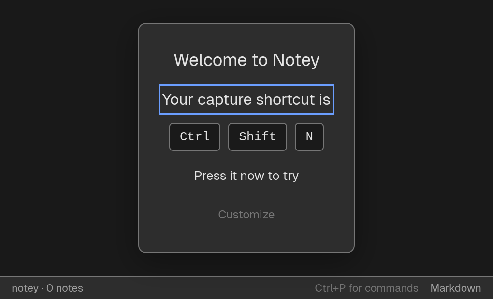
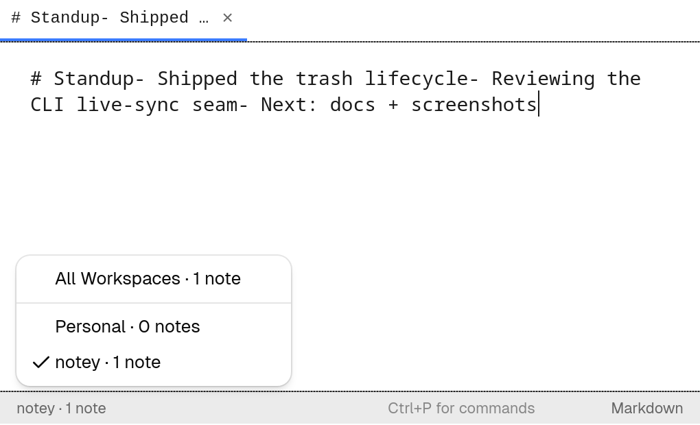

# User guide

This guide walks through Notey's features. For the complete shortcut list see
[Keyboard shortcuts](keyboard-shortcuts.md); for settings see
[Configuration](configuration.md).

## First run

On first launch Notey reveals itself and shows an onboarding overlay with the
capture hotkey. You can customize the hotkey there, then dismiss the overlay by
pressing `Esc` or the hotkey itself. On macOS, grant Accessibility permission when
prompted so the global hotkey works.

## Summoning and dismissing

Notey lives in the system tray and stays out of your way until you need it.

- **Summon:** press the global hotkey (`Ctrl+Shift+N`, or `Cmd+Shift+N` on macOS),
  or click the tray icon → **Open Notey**.
- **Dismiss:** press `Esc`, or press the hotkey again. The window hides — it never
  quits — so your work is right where you left it next time.
- **Quit:** use the tray menu → **Quit**.

## Capturing notes

Type into the editor and Notey saves automatically — there is no save button. The
status bar shows the save state (saving / **Saved** / failed) on the right.

- **New note:** `Ctrl+N`.
- **Format:** toggle between **Markdown** and **Plain text** from the status bar or
  the command palette. The choice is remembered per note.

## Tabs

Keep several notes open at once. The tab bar runs along the top.

- **Next / previous tab:** `Ctrl+Tab` / `Ctrl+Shift+Tab`.
- **Jump to tab 1–9:** `Ctrl+1` … `Ctrl+9`.
- **Close tab:** `Ctrl+W`.

Tabs, cursor position, and scroll are restored when you reopen Notey.

## The command palette

Press `Ctrl+P` to open the command palette — a fuzzy-searchable menu of every
action: new note, search, trash, export, settings, theme, layout, and more.

## Workspaces

Notes are grouped into **workspaces**, typically tied to a project directory. The
workspace selector lives in the status bar (bottom-left).

- Switch the active workspace from the selector or the **Switch Workspace** command.
- Choose **All Workspaces** to see notes from every workspace at once.

## Search

Press `Ctrl+F` to open full-text search. Results rank by relevance (FTS5/BM25) and
show match snippets. Scope the search to the current workspace or all workspaces.

## The note list

Press `Ctrl+B` to slide out the note list for the current workspace. Navigate with
the arrow keys and press `Enter` to open a note.

## Trash & restore

Deleting a note moves it to the trash (it isn't gone). Open **View Trash** from the
command palette to restore notes or delete them permanently.

Trashed notes are automatically purged after the retention window (default 30 days
— see [Configuration](configuration.md)).

## Export

From the command palette:

- **Export to Markdown** — writes one `.md` file per note into a folder you choose.
- **Export to JSON** — writes all your notes to a single JSON document.

## Personalization

Open **Settings** with `Ctrl+,`.

- **Theme:** System / Dark / Light. Toggle quickly with `Ctrl+Shift+T`.
- **Layout:** Floating (the always-on-top capture window), Half-screen, or
  Full-screen.
- **Font:** size and family (monospace or sans-serif).
- **Shortcuts:** rebind in-app shortcuts; conflicts are detected and rejected.
- **Start on login:** launch Notey automatically when you log in.

Notey looks right in the dark, too:

